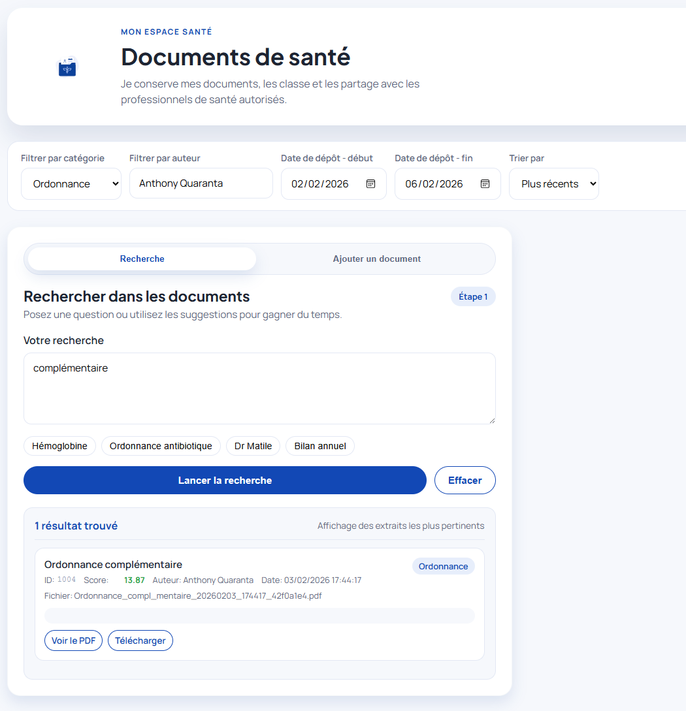

# Recherche Documentaire Augmentee par l'IA

Application Spring Boot de demonstration pour indexer, enrichir et retrouver rapidement des documents via OCR, recherche plein texte et recherche semantique par embeddings.

Le projet est pense comme un POC convaincant et exploitable en demo:

- ingestion de documents et extraction OCR
- recherche lexicale rapide avec Lucene
- recherche semantique avec embeddings BERT
- autocompletion auteur
- interface web locale de demonstration
- API REST documentee avec Swagger



## Proposition de valeur

Ce projet montre une approche moderne de la recherche documentaire, avec un parti pris simple et efficace:

- des index maintenus en memoire pour reduire la latence
- une restauration au demarrage depuis des snapshots persistants
- un chiffrement applicatif des donnees sensibles stockees en base
- deux strategies de recherche activables selon le besoin: precision lexicale ou proximite semantique

L'objectif n'est pas seulement de "faire de l'IA", mais de montrer un socle de recherche documentaire:

- lisible pour une demo ou un POC
- assez concret pour parler performance, securite et UX
- suffisamment modulaire pour evoluer vers un prototype plus industriel

## Fonctionnalites

- depot et stockage local de documents
- sauvegarde des metadonnees en base H2
- extraction OCR via PDFBox, Tika ou Tesseract selon la configuration
- indexation Lucene plein texte
- indexation semantique BERT via DJL + Hugging Face
- autocompletion sur les auteurs avec regroupement des variantes
- interface web locale avec recherche, indexation et maintenance
- endpoints REST exposes via Swagger UI

## Stack technique

- Java 25
- Spring Boot 4
- Maven
- H2
- Apache Lucene
- Apache PDFBox
- Apache Tika
- Tesseract
- DJL
- Hugging Face sentence transformers

## Deux modes de recherche

Le projet peut fonctionner avec deux strategies principales:

- `lucene`: recherche lexicale classique, basee sur les termes presents dans les documents
- `bert`: recherche semantique basee sur des embeddings, avec reranking lexical pour mieux controler la precision

Le mode par defaut se configure dans [application.yml](/C:/dev/vvlabs/recherche-documentaire/src/main/resources/application.yml).

## Architecture et performance

Le choix technique central du projet est le suivant: les index de recherche sont utilises en memoire.

Pourquoi:

- eviter les lectures disque sur le chemin critique de recherche
- limiter la latence lors des recherches et des filtres
- garder un comportement de demo tres reactif, y compris sur des corpus modestes

Concretement:

- l'index Lucene documentaire est charge en memoire au demarrage
- le store BERT est lui aussi recharge en memoire au demarrage
- la recherche s'execute ensuite uniquement sur ces structures memoire

Pour ne pas perdre l'etat entre deux redemarrages, l'application persiste separement un snapshot complet de l'index:

- Lucene: serialisation des fichiers de l'index en un blob
- BERT: serialisation du store complet avec les metadonnees, le contenu indexe et les vecteurs

Au redemarrage:

- le snapshot est relu depuis la base
- il est dechiffre
- l'index est reconstruit en memoire

Cette architecture donne un bon compromis pour un POC:

- lecture tres rapide
- demarrage deterministic
- pas besoin de recalculer integralement l'index a chaque lancement

## Enjeux de securite

Le projet traite volontairement la securite applicative a un niveau visible en demo.

### Ce qui est chiffre

Les donnees suivantes sont chiffrees avant stockage en base via `CipherService`:

- metadonnees documentaires sensibles
- snapshot complet de l'index Lucene
- snapshot complet du store BERT

Cela signifie que les snapshots d'index persistants ne sont pas stockes en clair dans la base.

### Ce qui est en memoire

Pour des raisons de performance, les index sont manipules dechiffres en RAM:

- l'index Lucene en memoire contient les champs recherches en clair
- le store BERT en memoire contient les textes indexes et les vecteurs

C'est un compromis volontaire:

- meilleur temps de reponse en lecture
- contrepartie: si l'environnement d'execution est compromis, la memoire applicative devient une surface sensible

### Ce que cela implique

Ce projet est adapte a:

- une demo
- un POC
- un prototype interne maitrise

Ce projet n'est pas, en l'etat, un produit "zero trust" ou un socle durci pour des environnements fortement contraints.

Pour aller plus loin en environnement sensible, il faudrait envisager:

- une gestion secrete de cle de chiffrement plus robuste qu'une simple configuration locale
- du durcissement d'hebergement et de l'isolation memoire
- une politique de droits d'acces et d'audit
- une revue des donnees effectivement presentes en clair dans les index
- eventuellement une segmentation plus fine entre donnees d'index et donnees affichables

## Donnees generees

- `storage/` contient la base locale et les documents stockes
- `lucene-suggest/` contient l'index d'autocompletion auteur
- la base H2 contient les snapshots chiffres des index documentaires

Important:

- les snapshots Lucene et BERT sont stockes chiffrés en base
- les index sont rechargés en memoire au demarrage
- l'index d'autocompletion auteur reste un index Lucene local sur disque, utile pour l'UX, distinct des snapshots documentaires

## Prerequis

- Java 25+
- Maven 3.9+
- 8 Go de RAM recommandes
- acces reseau au premier usage des embeddings si le modele doit etre recupere

## Demarrage local

```bash
mvn install
java -jar ./target/poc-recherche-documentaire-1.0.0-SNAPSHOT.jar
```

Acces utiles:

- UI web: `http://localhost:8080/index.html`
- Swagger: `http://localhost:8080/swagger-ui/index.html`
- Console H2: `http://localhost:8080/h2-console/`

## Docker

```bash
docker build -t poc-recherche-documentaire .
docker run --rm -p 8080:8080 -v ${PWD}/storage:/app/storage -v ${PWD}/lucene-suggest:/app/lucene-suggest poc-recherche-documentaire
```

Le conteneur conserve la base H2, les documents et l'index d'autocompletion dans les volumes montes sous `/app/storage` et `/app/lucene-suggest`.

## Formats supportes

| Type de document | Format | Traitement |
| --- | --- | --- |
| Facture | PDF, image | OCR |
| Rapport | PDF, image | OCR |
| Contrat | PDF, image | OCR |
| Note | PDF, image | OCR |

## Interface de demonstration

L'interface web locale permet de:

- lancer une recherche documentaire
- indexer un nouveau document
- relancer des actions de maintenance comme le rebuild de l'index auteur

Cela facilite la demonstration du cycle complet:

1. depot d'un document
2. OCR et indexation
3. recherche
4. maintenance ciblée si necessaire

## Limites actuelles

- POC destine a la demonstration, pas a la production
- pas de gestion avancee des droits ni du multi-tenant
- qualite OCR dependante du type de document
- la recherche semantique depend du modele et du runtime DJL disponibles
- les index documentaires sont performants car charges en memoire, au prix d'une exposition memoire plus forte
- l'autocompletion auteur repose sur un index local distinct, reconstruit si necessaire

## Positionnement IA

Oui, ce projet utilise de l'IA.

Plus precisement:

- OCR pour convertir un document image ou PDF en texte exploitable
- modele de langage de type Sentence-BERT pour produire des embeddings
- recherche semantique par similarite vectorielle sur les documents indexes

Il s'agit donc d'un POC de recherche documentaire assistee par IA, avec une base applicative simple, demonstrable et orientee performance.

## Publication

Le projet a ete neutralise pour une publication publique:

- vocabulaire metier rendu generique
- identifiants projet renommes
- references specifiques retirees de l'UI et de la documentation

## CI GitHub

Le workflow GitHub Actions [`.github/workflows/build.yml`](.github/workflows/build.yml):

- compile et teste le projet avec Maven sur JDK 25
- verifie que l'image Docker se construit correctement sur les pull requests
- publie l'image Docker dans GitHub Container Registry (`ghcr.io`) lors des pushes sur `main` et des tags `v*`
