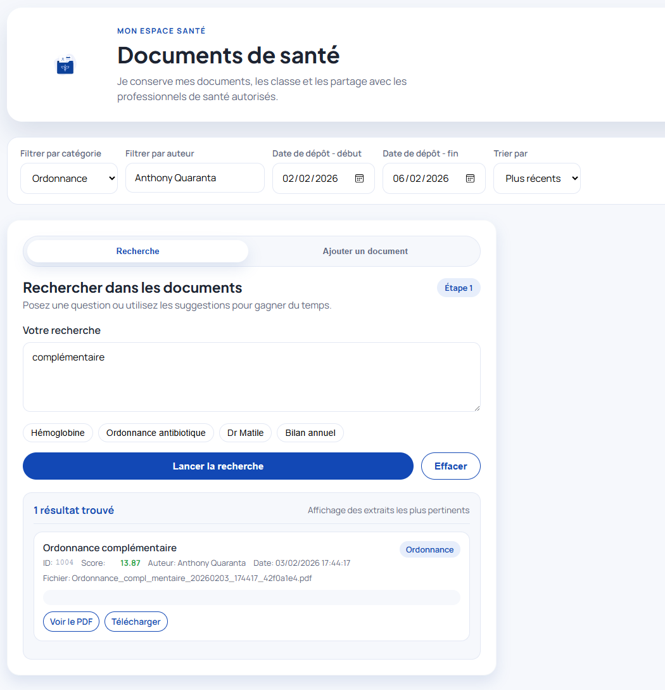

# Recherche Documentaire Augmentee par l'IA

POC Spring Boot de recherche documentaire combinant OCR, indexation plein texte, recherche semantique par embeddings et interface de demonstration locale.



## Objectif

Le projet sert a demonstrer une architecture simple mais evolutive pour:

- ingerer des documents et extraire leur texte
- indexer ce contenu avec plusieurs strategies
- rechercher soit en plein texte, soit en semantique
- persister des snapshots d'index chiffres
- preparer une evolution vers des stores vectoriels plus scalables

Ce n'est pas un produit fini. C'est un POC structure pour permettre des discussions techniques sur l'indexation, la recherche, les feature flags, la securite et les choix d'architecture.

## Fonctionnalites

- upload et stockage local ou S3 des documents
- metadonnees documentaires en base PostgreSQL
- OCR via PDFBox, Tika et Tesseract selon la configuration
- mode d'indexation `lucene`
- mode d'indexation `bert`
- mode d'indexation `lucene-vector`
- mode de recherche `lucene`
- mode de recherche `bert`
- mode de recherche `lucene-vector`
- autocompletion auteur avec Lucene
- snapshots chiffres des index documentaires
- API REST Swagger + UI web locale

## Architecture

### Documents et OCR

Les documents sont stockes via `StorageService`.
Les metadonnees sont persistees via `DocumentService`.
Le texte est extrait via `OCRServiceFactory`.

Les implementations de parser/OCR sont elles aussi isolees dans des modules Maven
dedies, tout en restant embarquees ensemble dans la webapp pour eviter les
combinaisons de profils:

- `recherche-documentaire-parser-tesseract`
- `recherche-documentaire-parser-pdfbox`
- `recherche-documentaire-parser-tika`

Les implementations de stockage sont isolees dans des modules Maven dedies,
mais restent embarquees ensemble dans la webapp pour eviter de croiser des
combinaisons de profils `engine` et `storage`:

- `recherche-documentaire-storage-fs`
- `recherche-documentaire-storage-s3`
- `recherche-documentaire-storage-netapp`

Par defaut, `application.yml` cible un poste Windows local avec une installation
Tesseract classique. Les profils `lucene`, `lucene-vector` et `bert`
surchargent le `dataPath` Tesseract pour un environnement Linux/Docker.

### Trois pipelines de recherche

Le projet separe maintenant explicitement:

- `app.indexer.default`
- `app.search.default`

Cela permet de choisir distinctement le moteur utilise pour l'indexation et celui utilise pour la recherche, meme si dans la configuration courante les deux pointent vers `lucene-vector`.

Les moteurs a base d'embeddings (`bert` et `lucene-vector`) indexent desormais
le meme contenu textuel que Lucene:

- titre
- auteur
- categorie
- nom de fichier
- contenu OCR

#### Mode Lucene

- index documentaire en memoire via `LuceneConfig`
- persistance du snapshot Lucene dans la table `lucene_index`
- recherche plein texte avec filtres categorie/auteur/date

#### Mode BERT

- generation d'embeddings via DJL + Hugging Face
- store d'embeddings abstrait via `BertEmbeddingsStore`
- recherche semantique + reranking lexical
- persistance du snapshot BERT dans la table `bert_embeddings_index`

#### Mode Lucene Vector

- index documentaire Lucene avec champs vectoriels natifs
- generation des embeddings via `BertEmbeddingsService`
- recherche KNN Lucene avec filtres categorie/auteur/date
- persistance du snapshot Lucene vectoriel dans la table `lucene_vector_index`

## Stores d'embeddings BERT

Le projet supporte plusieurs implementations de store vectoriel:

- `hashmap`
- `faiss-remote`
- `qdrant`
- `milvus`

### Store par defaut

Le store par defaut est configure par:

```yaml
app:
  embeddings:
    store:
      default: hashmap
```

### `hashmap`

Mode local du POC:

- store en memoire via `ConcurrentHashMap`
- recherche par scan du store
- calcul du score semantique en RAM

### `faiss-remote`

Service Python FAISS livre dans `faiss-service/`:

- API REST FastAPI (port `8090`)
- index `IndexFlatIP` avec normalisation L2 (similarite cosinus)
- filtres categorie/auteur/date identiques au store `hashmap`
- `limit <= 0` traite comme "sans limite"
- le POC Java appelle ce service via `FaissRemoteBertEmbeddingsStore`

Le moyen le plus simple de le tester est le `docker-compose.yml` fourni (voir section **Integration FAISS avec Docker Compose**).

Configuration manuelle:

```yaml
app:
  embeddings:
    store:
      default: faiss-remote
      faiss:
        enabled: true
        base-url: http://localhost:8090
```

### `qdrant`

Store vectoriel distant base sur le serveur officiel Qdrant:

- API REST Qdrant (port `6333` par defaut)
- collection creee automatiquement au premier `upsert`
- payload enrichi pour conserver `title`, `author`, `category`, `filename`, `depotDateTime`, `contentText`
- filtres `category`, `author`, `dateFrom`, `dateTo` alignes sur le comportement du store `hashmap`
- les filtres texte sont normalises en minuscules cote payload pour reproduire le `equalsIgnoreCase`

Configuration manuelle:

```yaml
app:
  embeddings:
    store:
      default: qdrant
      qdrant:
        enabled: true
        base-url: http://localhost:6333
        api-key: ""
        collection: document-embeddings
        batch-size: 128
```

Le moyen le plus simple de le tester est le fichier `docker-compose.qdrant.yml` fourni.

### `milvus`

Store vectoriel distant base sur l'API REST v2 de Milvus:

- creation automatique de la collection au premier `upsert`
- collection creee avec `documentId` comme cle primaire, champ vectoriel `embedding` et champs dynamiques actives
- filtres `category`, `author`, `dateFrom`, `dateTo` traduits en expression Milvus
- `replaceAll` effectue un drop/recreate puis un rechargement par batchs

Configuration manuelle:

```yaml
app:
  embeddings:
    store:
      default: milvus
      milvus:
        enabled: true
        base-url: http://localhost:19530
        token: ""
        collection: document_embeddings
        batch-size: 128
```

Le profil Maven selectif associe est `store-milvus`.

## Feature flags et configuration

Les principaux flips de configuration sont:

```yaml
app:
  indexer:
    default: bert
    use-database: true
  search:
    default: bert
    wildcard: false
    vector:
      max-results: 25
      candidate-multiplier: 4
      min-score: 0.55
    distance:
      enabled: false
      levenshtein: ~2
  embeddings:
    model-id: sentence-transformers/all-MiniLM-L6-v2
    store:
      default: hashmap
      faiss:
        enabled: false
        base-url: http://localhost:8090
    search:
      max-results: 25
      min-score: 0.10
      semantic-weight: 0.75
      lexical-weight: 0.25
      candidate-limit: 0
  parser:
    ocr:
      enabled: true
      default: pdfbox
      tesseract:
        dataPath: C:/Program Files/Tesseract-OCR/tessdata
  storage:
    default: fs
    s3:
      enabled: false
  cipher:
    enabled: true
  task:
    ocr:
      enabled: false
```

### Sens des flags

- `app.indexer.default`: moteur d'indexation principal (`lucene`, `bert` ou `lucene-vector`)
- `app.search.default`: moteur de recherche principal (`lucene`, `bert` ou `lucene-vector`)
- `app.indexer.use-database`: persistance des snapshots d'index en base
- `app.search.vector.max-results`: nombre maximal de resultats du moteur `lucene-vector`
- `app.search.vector.candidate-multiplier`: multiplicateur du nombre de candidats KNN explores par `lucene-vector`
- `app.embeddings.store.default`: implementation du store BERT
- `app.embeddings.store.faiss.enabled`: active le client FAISS distant
- `app.storage.default`: backend de stockage (`fs`, `s3` ou `netapp`)
- `app.storage.s3.enabled`: active le bean S3 (necessite un serveur S3 ou MinIO)
- `app.storage.netapp.enabled`: active le bean NetApp (necessite un partage deja monte)
- `app.task.ocr.enabled`: active la tache OCR asynchrone
- `app.search.wildcard`: ajoute un wildcard sur certaines requetes non Lucene
- `app.search.distance.enabled`: active l'extension fuzzy configuree pour les requetes non Lucene
- `app.parser.ocr.tesseract.dataPath`: chemin du repertoire `tessdata`

## Securite

Le projet chiffre:

- les metadonnees documentaires sensibles
- les snapshots Lucene
- les snapshots BERT

Le chiffrement est realise par `CipherService`.

Important:

- les structures de recherche restent dechiffrees en memoire
- ce choix est volontaire pour la performance et la simplicite du POC

## Donnees persistees

- `storage/` contient les documents et les caches locaux de l'application
- `lucene-suggest/` contient l'index d'autocompletion
- PostgreSQL contient les metadonnees et les snapshots chiffres separes par moteur:
- `lucene_index` pour `lucene`
- `bert_embeddings_index` pour `bert`
- `lucene_vector_index` pour `lucene-vector`

Ce decouplage evite toute confusion quand on change `app.indexer.default` ou `app.search.default` entre plusieurs campagnes de test.

## Stack technique

- Java 25
- Spring Boot 4
- Maven
- PostgreSQL
- Apache Lucene
- Apache PDFBox
- Apache Tika
- Tesseract
- DJL
- Hugging Face sentence-transformers
- Python 3.11 + FastAPI + FAISS (service `faiss-service/`)
- AWS SDK v2 S3 (compatible MinIO)

## Modules Maven et packaging selectif

La webapp runnable est le module `recherche-documentaire-webapp-demo`.
Le projet accepte maintenant des profils Maven pour n'embarquer dans le jar Spring Boot que les engines utiles au scenario cible.

Profils disponibles :

| Profil Maven | Contenu embarque | Cas d'usage |
|---|---|---|
| `all-engines` | tous les modules d'engine et de store | image generique par defaut |
| `engine-lucene` | moteur `lucene` uniquement | image la plus legere pour recherche texte |
| `engine-lucene-vector` | moteur `lucene-vector` uniquement | image vectorielle Lucene native |
| `store-qdrant` | store BERT `qdrant` uniquement | profil `bert` avec backend Qdrant |
| `store-faiss` | store BERT `faiss-remote` uniquement | profil `bert` avec backend FAISS |
| `store-milvus` | store BERT `milvus` uniquement | profil `bert` avec backend Milvus |

Exemples Maven :

```bash
mvn -B -pl recherche-documentaire-webapp-demo -am -Pengine-lucene -DskipTests package
mvn -B -pl recherche-documentaire-webapp-demo -am -Pengine-lucene-vector -DskipTests package
mvn -B -pl recherche-documentaire-webapp-demo -am -Pstore-qdrant -DskipTests package
mvn -B -pl recherche-documentaire-webapp-demo -am -Pstore-faiss -DskipTests package
mvn -B -pl recherche-documentaire-webapp-demo -am -Pstore-milvus -DskipTests package
```

Important :

- les profils Maven pilotent ce qui est **embarque au build**
- `SPRING_PROFILES_ACTIVE` pilote toujours le comportement **au runtime**
- le profil runtime choisi doit rester coherent avec les modules packages

## Demarrage local

```bash
mvn install
docker run --name recherche-postgres -e POSTGRES_DB=recherche_documentaire -e POSTGRES_USER=postgres -e POSTGRES_PASSWORD=postgres -p 5432:5432 -d postgres:17-alpine
java -jar ./recherche-documentaire-webapp-demo/target/poc-recherche-documentaire-1.0.0-SNAPSHOT.jar
```

Le fichier `application.yml` est le mode POC par defaut sous Windows.
La connexion PostgreSQL locale cible par defaut :

```text
jdbc:postgresql://localhost:5432/recherche_documentaire
username=postgres
password=postgres
```

Vous pouvez surcharger ces valeurs via `APP_DB_HOST`, `APP_DB_PORT`, `APP_DB_NAME`, `APP_DB_USERNAME`, `APP_DB_PASSWORD`.

Si Tesseract est installe classiquement, verifier:

```yaml
app:
  parser:
    ocr:
      tesseract:
        dataPath: C:/Program Files/Tesseract-OCR/tessdata
```

Le profil optionnel `local-windows` peut aussi servir a isoler ce chemin si vous
preferez ne pas le laisser dans votre configuration principale.

Acces utiles en mode local:

- UI web: `http://localhost:8080/index.html`
- Swagger: `http://localhost:8080/swagger-ui/index.html`
- Health: `http://localhost:8080/actuator/health`
- Prometheus: `http://localhost:8080/actuator/prometheus`

## Integration Lucene + PostgreSQL avec Docker Compose

Le fichier `docker-compose.lucene.yml` demarre l'application Spring Boot en profil `lucene` avec PostgreSQL:

```bash
docker compose -f docker-compose.lucene.yml up --build
```

Ce qui est lance:

| Service | Port | Description |
|---------|------|-------------|
| `postgres` | 5432 | Base PostgreSQL du POC |
| `app`      | 8080 | Spring Boot en profil `lucene` |

Le build Docker de ce compose passe automatiquement `MAVEN_PROFILES=engine-lucene` pour n'embarquer que le moteur Lucene dans l'image applicative.

Arret:

```bash
docker compose -f docker-compose.lucene.yml down
```

## Docker

### Image Spring Boot seule

Ces exemples supposent qu'un PostgreSQL est deja accessible.
Le plus simple reste d'utiliser `docker-compose.lucene.yml`; sinon, injecter explicitement l'URL JDBC adaptee a votre environnement Docker.

```bash
docker build -t poc-recherche-documentaire .
docker run --rm -p 8080:8080 \
  -e SPRING_PROFILES_ACTIVE=lucene-vector \
  -e SPRING_DATASOURCE_URL=jdbc:postgresql://host.docker.internal:5432/recherche_documentaire \
  -e SPRING_DATASOURCE_USERNAME=postgres \
  -e SPRING_DATASOURCE_PASSWORD=postgres \
  -v ${PWD}/storage:/app/storage \
  -v ${PWD}/lucene-suggest:/app/lucene-suggest \
  poc-recherche-documentaire
```

Pour construire une image plus legere, vous pouvez cibler explicitement un profil Maven :

```bash
docker build --build-arg MAVEN_PROFILES=engine-lucene -t poc-recherche-documentaire:lucene .
docker build --build-arg MAVEN_PROFILES=engine-lucene-vector -t poc-recherche-documentaire:lucene-vector .
docker build --build-arg MAVEN_PROFILES=store-qdrant -t poc-recherche-documentaire:bert-qdrant .
docker build --build-arg MAVEN_PROFILES=store-faiss -t poc-recherche-documentaire:bert-faiss .
docker build --build-arg MAVEN_PROFILES=store-milvus -t poc-recherche-documentaire:bert-milvus .
```

Le `Dockerfile` garde `all-engines` par defaut pour conserver une image generique si aucun `build-arg` n'est passe.

Pour le mode `bert` ou `lucene-vector`, monter aussi le cache DJL pour eviter
de retelecharger PyTorch (~600 MB) a chaque redemarrage :

```bash
docker run --rm -p 8080:8080 \
  -e SPRING_PROFILES_ACTIVE=bert \
  -e SPRING_DATASOURCE_URL=jdbc:postgresql://host.docker.internal:5432/recherche_documentaire \
  -e SPRING_DATASOURCE_USERNAME=postgres \
  -e SPRING_DATASOURCE_PASSWORD=postgres \
  -v ${PWD}/storage:/app/storage \
  -v ${PWD}/lucene-suggest:/app/lucene-suggest \
  -v djl-cache:/root/.djl.ai \
  poc-recherche-documentaire
```

Limiter la memoire sur un NAS via `JAVA_OPTS` (par defaut `MaxRAMPercentage=50`) :

```bash
docker run --rm -p 8080:8080 \
  -e SPRING_PROFILES_ACTIVE=lucene \
  -e SPRING_DATASOURCE_URL=jdbc:postgresql://host.docker.internal:5432/recherche_documentaire \
  -e SPRING_DATASOURCE_USERNAME=postgres \
  -e SPRING_DATASOURCE_PASSWORD=postgres \
  -e JAVA_OPTS="-Xmx512m" \
  -v ${PWD}/storage:/app/storage \
  poc-recherche-documentaire
```

L'image Docker:

- installe `tesseract-ocr`
- telecharge `fra.traineddata`
- place les donnees dans `/usr/share/tessdata`

Sous Linux/Docker, lancer explicitement un des profils metier:

- `lucene` — moteur le plus leger, recommande sur NAS
- `lucene-vector`
- `bert` — necessite ~600 MB de natifs PyTorch au premier demarrage
- `milvus` — profil `bert` preconfigure avec le store Milvus

Chacun surcharge `app.parser.ocr.tesseract.dataPath` avec le chemin Linux adapte.

### Optimisation Docker (layered jar)

Le Dockerfile utilise `jarmode=layertools` pour separer les dependances du code
applicatif en 4 couches Docker distinctes.
Lors d'un rebuild apres une modification du code, seule la couche `application/`
est retransferee — les dependances (~300 MB) restent en cache local et ne sont
pas re-uploadees sur le NAS.

### Note architecture NAS

Verifier l'architecture du NAS avant de construire l'image :

| Architecture NAS | Flag `--platform` |
|---|---|
| x86_64 (Synology DS+, QNAP x86) | `--platform linux/amd64` |
| ARM64 (Synology ARMv8) | `--platform linux/arm64` |

Les natifs DJL/PyTorch sont telecharges automatiquement pour la bonne
architecture si le cache `/root/.djl.ai` est vide.

## Integration FAISS avec Docker Compose

Le fichier `docker-compose.yml` demarre les services FAISS, PostgreSQL et l'application en une commande:

```bash
docker compose up --build
```

Ce qui est lance:

| Service | Port | Description |
|---------|------|-------------|
| `postgres` | 5432 | Base PostgreSQL du POC |
| `faiss` | 8090 | Service Python FAISS (`faiss-service/`) |
| `app`   | 8080 | Spring Boot en profil `bert` + store `faiss-remote` |

Le build Docker de ce compose passe automatiquement `MAVEN_PROFILES=store-faiss` pour ne garder que le store Java utile a ce scenario.

L'application attend que PostgreSQL et FAISS soient prets avant de demarrer (`depends_on: condition: service_healthy`).

Un volume nomme `djl-cache` persiste le modele `sentence-transformers/all-MiniLM-L6-v2` entre les redemarrages pour eviter un re-telechargement.

Arret:

```bash
docker compose down
```

Acces utiles une fois demarre:

- UI web: `http://localhost:8080/index.html`
- Swagger: `http://localhost:8080/swagger-ui/index.html`
- FAISS stats: `http://localhost:8090/api/faiss/stats`
- FAISS docs API: `http://localhost:8090/docs`

## Integration Qdrant avec Docker Compose

Le fichier `docker-compose.qdrant.yml` demarre l'application Spring Boot avec le store `qdrant`, PostgreSQL et un serveur Qdrant officiel:

```bash
docker compose -f docker-compose.qdrant.yml up --build
```

Ce qui est lance:

| Service | Port | Description |
|---------|------|-------------|
| `postgres` | 5432 | Base PostgreSQL du POC |
| `qdrant` | 6333 | Serveur Qdrant officiel |
| `app`    | 8080 | Spring Boot en profil `bert` + store `qdrant` |

Le build Docker de ce compose passe automatiquement `MAVEN_PROFILES=store-qdrant` pour ne garder que le store Java utile a ce scenario.

Arret:

```bash
docker compose -f docker-compose.qdrant.yml down
```

Acces utiles une fois demarre:

- UI web: `http://localhost:8080/index.html`
- Swagger: `http://localhost:8080/swagger-ui/index.html`
- Qdrant collections: `http://localhost:6333/collections`

## Integration Milvus avec Docker Compose

Le fichier `docker-compose.milvus.yml` demarre l'application Spring Boot avec le profil `milvus`, PostgreSQL, un Milvus standalone et ses dependances officielles `etcd` et `minio`:

```bash
docker compose -f docker-compose.milvus.yml up --build
```

Ce qui est lance:

| Service | Port | Description |
|---------|------|-------------|
| `postgres` | 5432 | Base PostgreSQL du POC |
| `etcd` | 2379 | Metadonnees internes Milvus |
| `minio` | 9000 / 9001 | Stockage objet interne Milvus |
| `milvus` | 19530 / 9091 | Serveur Milvus standalone |
| `app` | 8080 | Spring Boot en profil `milvus` + store `milvus` |

Le build Docker de ce compose passe automatiquement `MAVEN_PROFILES=store-milvus` pour ne garder que le store Java utile a ce scenario.

Arret:

```bash
docker compose -f docker-compose.milvus.yml down
```

Acces utiles une fois demarre:

- UI web: `http://localhost:8080/index.html`
- Swagger: `http://localhost:8080/swagger-ui/index.html`
- Milvus health: `http://localhost:9091/healthz`
- MinIO console: `http://localhost:9001`

## Stockage S3 / MinIO

Le backend de stockage `s3` permet d'utiliser n'importe quel serveur S3 compatible au lieu du systeme de fichiers local.

**Aucune image Docker custom n'est necessaire.** Le client AWS SDK v2 utilise `endpointOverride` et `forcePathStyleAccess(true)`, ce qui le rend compatible avec toute implementation S3 standard :

| Serveur | Usage |
|---------|-------|
| `minio/minio` | image Docker officielle, ideal en local |
| `localstack/localstack` | alternative locale avec emulation AWS |
| AWS S3 | laisser `endpoint` vide, credentiels IAM |

### Configuration

Dans `application.yml`:

```yaml
app:
  storage:
    default: s3
    s3:
      enabled: true
      endpoint: http://localhost:9000   # vide pour AWS S3 natif
      region: us-east-1
      access-key: minioadmin
      secret-key: minioadmin
      bucket: documents
      cache-path: ./storage/s3-cache
      auto-create-bucket: true
```

### Test local avec MinIO (image officielle)

```bash
docker run -d --name minio \
  -p 9000:9000 -p 9001:9001 \
  -e MINIO_ROOT_USER=minioadmin \
  -e MINIO_ROOT_PASSWORD=minioadmin \
  minio/minio server /data --console-address ":9001"
```

- Console MinIO: `http://localhost:9001`
- API S3: `http://localhost:9000`

### Test local avec LocalStack

```bash
docker run -d --name localstack \
  -p 4566:4566 \
  -e SERVICES=s3 \
  localstack/localstack
```

Adapter ensuite la configuration :

```yaml
app:
  storage:
    s3:
      endpoint: http://localhost:4566
      access-key: test
      secret-key: test
```

### Fonctionnement

- les documents uploades sont stockes dans le bucket S3
- un cache local (`s3-cache/`) sert de relais pour les composants qui manipulent des `Path`
- le bucket est cree automatiquement au demarrage si `auto-create-bucket: true`
- les statistiques (`AppStatsService`) refletent uniquement le cache local, pas le bucket complet
- `moveFile` effectue un copy + delete sur S3 puis un move local du cache

## Stockage NetApp (partage monte)

Le backend `netapp` cible un partage NetApp deja monte sur l'hote ou dans le conteneur
(NFS, SMB ou CIFS). Il n'utilise pas d'API NetApp proprietaire: il s'appuie sur un
repertoire monte et reste donc compatible avec les composants du POC qui manipulent
des `Path` locaux.

### Configuration

```yaml
app:
  storage:
    default: netapp
    netapp:
      enabled: true
      path: /mnt/netapp/documents
      require-existing-path: true
      auto-create-directories: true
```

### Points d'attention

- `require-existing-path: true` evite de creer par erreur un dossier local si le partage n'est pas monte
- `auto-create-directories: true` cree le sous-repertoire cible seulement si le point de montage existe deja
- `moveFile` et `deleteFile` restent des operations de systeme de fichiers classiques sur le partage monte
- ce mode est bien adapte a un NAS expose en montage reseau, contrairement au mode `s3` qui passe par une API objet

## Limites actuelles

- POC oriente demonstration
- pas de multi-tenant
- pas de gestion avancee des droits
- mode `hashmap` non scalable pour gros corpus
- service FAISS entierement en memoire : un redemarrage du conteneur vide l'index (recharger les documents depuis Spring Boot)
- mode `s3` : les statistiques refletent le cache local, pas le bucket complet
- mode `netapp` : la disponibilite depend du montage reseau fourni par l'hote ou l'orchestrateur

## Tests

La suite de tests couvre a present:

- services documentaires
- indexation Lucene, BERT et Lucene vectoriel
- recherche Lucene, BERT et Lucene vectorielle
- factories applicatives principales
- stores BERT `hashmap`, `faiss-remote`, `qdrant`, `milvus`
- stockage S3 (avec S3Client mocke)
- OCR PDFBox
- service de chiffrement

Execution:

```bash
mvn test
```

## CI/CD GitHub et deploiement NAS

Le workflow GitHub Actions `/.github/workflows/build.yml` execute maintenant :

- `mvn verify`
- un smoke test Docker du mode `lucene`
- un smoke test Docker Compose du mode `faiss`
- un smoke test Docker Compose du mode `qdrant`
- un smoke test Docker Compose du mode `milvus`
- la publication des images GHCR de l'application Spring Boot et du service `faiss-service`

Le deploiement NAS s'appuie sur `deploy/deploy-github-documents.sh`, qui demarre desormais :

- une instance `lucene`
- une instance `lucene-vector`
- une instance `bert` + store `faiss-remote`
- une instance `bert` + store `qdrant`
- les services de support `faiss` et `qdrant`

Qdrant utilise l'image officielle `qdrant/qdrant:latest`, il n'y a donc pas d'image Qdrant custom a publier dans GHCR.

