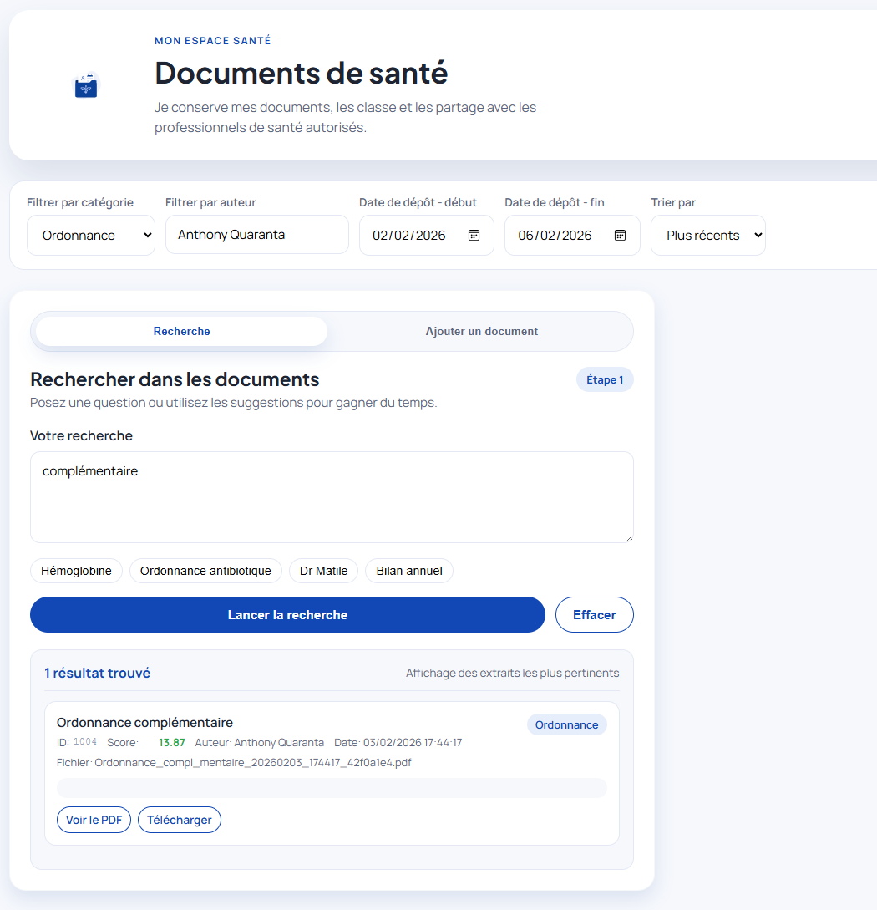

# Recherche Documentaire Augmentee par l'IA

POC Spring Boot de recherche documentaire combinant OCR, indexation plein texte, recherche semantique par embeddings et interface de demonstration locale.



## Objectif

Le projet sert a demonstrer une architecture simple mais evolutive pour:

- ingerer des documents et extraire leur texte
- indexer ce contenu avec plusieurs strategies
- rechercher soit en plein texte, soit en semantique
- persister des snapshots d'index chiffres
- preparer une evolution vers des stores vectoriels plus scalables

Ce n'est pas un produit fini. C'est un POC structure pour permettre des discussions techniques sur l'indexation, la recherche, les feature flags, la securite et les choix d'architecture.

## Fonctionnalites

- upload et stockage local ou S3 des documents
- metadonnees documentaires en base PostgreSQL
- OCR via PDFBox, Tika et Tesseract selon la configuration
- mode d'indexation `lucene`
- mode d'indexation `bert`
- mode d'indexation `lucene-vector`
- mode de recherche `lucene`
- mode de recherche `bert`
- mode de recherche `lucene-vector`
- autocompletion auteur avec Lucene
- snapshots chiffres des index documentaires
- API REST Swagger + UI web locale
- connexion par session, comptes PostgreSQL et administration des utilisateurs
- magasins documentaires cloisonnes : utilisateur, responsable, administrateur
- synthese optionnelle via une gateway IA locale ou cloud (Ollama, vLLM/Mistral, AWS Bedrock)

## Comptes, magasins et administration

Toutes les API documentaires necessitent une connexion. Les mots de passe sont
haches avec BCrypt ; les mutations utilisent un jeton CSRF. Les autorisations
sont recalculees depuis PostgreSQL a chaque requete : une desactivation ou un
changement de mot de passe revoque les sessions existantes, et un changement de
role/rattachement prend effet sans reindexer les documents.

| Role | Depot | Recherche, metadonnees, autocompletion et fichiers |
|---|---|---|
| `USER` | Son propre magasin | Son propre magasin ; responsable actif obligatoire |
| `MANAGER` | Son propre magasin | Son magasin et ceux des utilisateurs simples directement rattaches |
| `ADMIN` | Son propre magasin | Tous les documents, y compris les anciens sans proprietaire |

Le champ `owner_id` est distinct de l'auteur saisi et fixe par le serveur :
modifier un auteur ne change jamais les droits. Les filtres de recherche sont
appliques avant le top-k dans Lucene, Lucene Vector, hashmap, FAISS, Qdrant et
Milvus. Un second controle precede l'exposition des resultats et la synthese IA.
Les fichiers hors perimetre renvoient 404, sans confirmer leur existence.

Au **premier demarrage sur une base vide**, definir `APP_BOOTSTRAP_PASSWORD`
(12 caracteres minimum, 72 octets UTF-8 maximum). Aucun mot de passe initial
n'est versionne ou imprime dans les logs :

```powershell
$env:APP_BOOTSTRAP_PASSWORD = Read-Host -MaskInput 'Mot de passe initial du POC'
docker compose -f docker-compose.qdrant.yml up --build
```

Par defaut, le bootstrap cree `admin`, les responsables `carol` et `david`,
`alice` et `bob` rattaches a `carol`, et `eve` rattachee a `david`. Ces comptes
de demonstration partagent uniquement le mot de passe de bootstrap fourni.
Le bootstrap ne recree pas les comptes supprimes et ne change pas les mots de
passe au redemarrage. `APP_DEMO_USERS_ENABLED=false` cree seulement `admin`.
Changer les mots de passe de chaque compte pour des essais realistes.

### Depannage du demarrage sur une base existante

Une erreur fatale issue de `UserBootstrap` indiquant un mot de passe invalide
signifie que `app_user` est vide et que `APP_BOOTSTRAP_PASSWORD` est absent ou
ne respecte pas la limite de 12 caracteres minimum / 72 octets UTF-8 maximum.
Definir le secret dans **l'environnement du conteneur**, pas seulement dans
le shell du NAS. Un simple `docker restart` n'applique pas une nouvelle variable :
recreer le conteneur avec la configuration corrigee.

Pour un deploiement Compose utilisant un fichier de secrets non versionne :

```bash
docker compose --env-file .env.nas -f docker-compose.qdrant.yml up -d --force-recreate app
```

Le fichier `.env.nas` doit definir `APP_BOOTSTRAP_PASSWORD` ; ne pas partager
sa valeur ni la versionner. `APP_DEMO_USERS_ENABLED=false` evite de creer des
comptes de demonstration partageant le secret administrateur.

Une `EOFException` lors de la lecture du snapshot BERT est un probleme distinct :
son contenu est tronque ou correspond a un ancien format binaire. Les nouveaux
snapshots portent une signature et une version ; un snapshot invalide est
refuse **avant de remplacer le store**, et un echec de chargement interrompt le
demarrage au lieu de servir silencieusement un index obsolete.

La compatibilite des anciens snapshots BERT n'est pas conservee. Pour repartir
sans ce snapshot, arreter les instances BERT partageant la base, puis executer
dans la base PostgreSQL du POC :

```sql
DELETE FROM bert_embeddings_index WHERE index_name = 'bert_embeddings';
```

Cette commande ne supprime ni les comptes ni les documents. Au redemarrage,
le store BERT est remis a vide ; il est reconstruit depuis les documents lors
de la recherche ou via la maintenance. Ne pas faire tourner d'anciennes et
de nouvelles images ecrivant des formats differents dans la meme ligne de
snapshot. Les donnees locales du poste et celles d'un NAS sont independantes :
un reset local ne remet pas a zero la base distante du NAS.

La page `/login.html` ouvre une session. La page `/admin.html`, reservee aux
administrateurs, liste, ajoute, modifie et supprime les utilisateurs
(`/api/admin/users`). La suppression d'un compte possedant des documents ou
des utilisateurs rattaches est refusee : desactiver le compte ou reaffecter
ses utilisateurs. Le dernier administrateur actif ne peut pas etre retrograde
ou desactive ; un administrateur ne peut pas supprimer son propre compte.
Swagger, la maintenance, le bulk et les statistiques globales sont reserves
aux administrateurs. `/actuator/health` reste public.

Le login est centre et partage un logo local avec le portail, sans police ni
ressource graphique externe. La recherche utilise un champ compact de **50 px**
de hauteur initiale et minimale, redimensionnable verticalement : **Entree**
lance la recherche et **Maj + Entree** insere une nouvelle ligne. Sur mobile,
la recherche est accessible d'abord, avec un en-tete compact et des commandes
tactiles. Les filtres et les options IA sont replies par defaut ; leurs badges
indiquent les filtres actifs et l'activation/destination de la synthese.
L'avertissement cloud precede la case d'activation dans les options IA.

Les clients API doivent recuperer `/api/auth/csrf`, conserver le cookie, puis
poster `username` et `password` en formulaire sur `/api/auth/login` avec le
header annonce par le jeton. Recuperer un **nouveau jeton apres connexion**.
La deconnexion est un POST CSRF sur `/api/auth/logout`. HTTP Basic est aussi
disponible pour les lectures techniques (notamment Prometheus), uniquement
avec un compte autorise ; ne pas l'utiliser sans HTTPS hors localhost.

Les documents existants sans proprietaire ne sont pas attribues arbitrairement :
ils restent visibles seulement par l'administrateur. La migration SQL est
additive et ne supprime ni documents ni snapshots.

### Cloisonnement et chiffrement : deux protections distinctes

Le POC utilise une collection partagee dans Qdrant ou Milvus. Il n'envoie pas
de `userId` ou d'`ownerId` dans les chunks : la relation document/proprietaire
reste dans PostgreSQL. A chaque recherche, `DocumentAccessService` calcule les
IDs autorises selon le role et les rattachements, puis l'application impose
un filtre `documentId` avant le classement/limite dans le store. Un utilisateur
ne peut pas fournir son propre perimetre. Le sharding Qdrant distribue les
points ; il ne cree pas a lui seul des frontieres d'autorisation par utilisateur.

| Donnees | Protection applicative actuelle |
|---|---|
| PostgreSQL : `id`, `owner_id`, rattachements, dates, tailles | En clair ; utilises pour les relations et autorisations |
| PostgreSQL : titre, auteur, categorie, nom du fichier | AES-GCM via `DocumentMapper`, si `app.cipher.enabled=true` |
| PostgreSQL : snapshots complets Lucene / BERT / Lucene Vector | AES-GCM via `CipherService`, si le chiffrement et la persistance sont actives |
| Qdrant / Milvus : `documentId`, chunks, metadonnees, filtres et vecteurs | En clair du point de vue applicatif ; pas de chiffrement du payload |
| Fichiers originaux sur FS / NetApp / S3 | Pas de chiffrement applicatif ; protection du support/serveur a configurer |
| Mots de passe | Hachage BCrypt, pas de chiffrement reversible |

La cle de chiffrement est commune a l'application, pas une cle par utilisateur.
La cle de demonstration de la configuration n'est pas un secret de production.
Un snapshot chiffre en PostgreSQL ne chiffre pas la collection vivante reconstruite
dans Qdrant ou Milvus. Les embeddings ne sont pas des donnees anonymisees et
doivent aussi etre proteges.

Le cloisonnement protege les appels passant par l'application, pas un acces
direct d'un client a la base vectorielle. Pour un deploiement reel, garder les
stores sur un reseau prive, activer authentification/TLS et chiffrer volumes,
fichiers et sauvegardes selon les exigences de l'infrastructure. Chiffrer aussi
les textes du payload, ou ne plus les y stocker, demanderait une evolution
explicite des filtres, du reranking et de la restitution des extraits.

## Synthese IA et gateway

### LiteLLM et vLLM / Mistral (chemin recommande)

LiteLLM est un proxy optionnel, pas un serveur d'inference. Le profil `litellm`
conserve l'adaptateur applicatif pour les droits documentaires, les prompts bornes
et les citations, et delegue les appels aux modeles au proxy :

```text
Client -> APIM / ingress eventuel -> Spring Boot (recherche, droits, extraits)
       -> LiteLLM -> vLLM (modele Mistral servi sur la VM)
```

LiteLLM couvre les fonctions de gateway LLM et de routeur de deploiements.
Il ne remplace pas toute l'APIM Gravitee (gouvernance des autres API,
souscriptions, portail, cycle de vie). Authentification et controles d'acces
doivent preceder un eventuel classifieur de complexite. Les droits sur les
documents restent dans le backend ; un identifiant `user` transmis au proxy
n'est pas une ACL documentaire.

Pour plusieurs modeles de base, deployer plusieurs instances vLLM et les
declarer dans `config/litellm.yml`. Une instance vLLM peut repartir un modele sur
plusieurs GPU, mais n'est pas un routeur entre tous les modeles disponibles.
Le routage automatique par complexite propose par LiteLLM est en beta et
**n'est pas active ici** : ses regles et sa qualite doivent etre evaluees.

Comparaison retenue pour le POC, sans reprendre les benchmarks des fournisseurs :

| Option | Interet | Choix |
|---|---|---|
| [LiteLLM](https://docs.litellm.ai/docs/providers/vllm) | Provider `hosted_vllm`, API OpenAI, cache exact avec namespace/TTL par requete | Retenu ; reutilise notre contrat HTTP et permet de controler explicitement le cache |
| [Bifrost](https://github.com/maximhq/bifrost) | Gateway Go, API compatible, routage et plugins | Alternative valable ; pas de gain mesure justifiant une autre integration pour ce POC |
| [Portkey](https://github.com/Portkey-AI/gateway) | Routage conditionnel, retries, fallbacks, gateway auto-hebergeable | Alternative valable ; aucun besoin ici ne justifie de changer de contrat |

L'overlay `docker-compose.ai.yml` est commun aux six variantes existantes.
Il ajoute LiteLLM **1.104.2** et Valkey **9.1.2**, images epinglees par digest,
sans publier leurs ports. Le cache Valkey est authentifie, borne a 128 Mo,
en memoire uniquement (ni RDB, ni AOF, ni volume persistant). Le proxy utilise
un fichier declaratif, sans base LiteLLM ni UI d'administration exposee.
La cle du proxy est reservee au backend : ne jamais la transmettre au navigateur.
Les cles virtuelles, budgets persistants et RBAC de gestion LiteLLM ne sont pas
configures dans ce mode sans base ; les ajouter necessiterait une configuration
distincte. La limite applicative reste de deux syntheses simultanees par instance.

Exemple PowerShell, apres configuration du secret `APP_BOOTSTRAP_PASSWORD` :

```powershell
$env:APP_AI_GATEWAY_API_KEY = 'sk-' + [Convert]::ToHexString([System.Security.Cryptography.RandomNumberGenerator]::GetBytes(32))
$env:APP_AI_CACHE_PASSWORD = [Convert]::ToHexString([System.Security.Cryptography.RandomNumberGenerator]::GetBytes(32))
$env:APP_AI_VLLM_URL = 'http://vllm.internal:8000/v1'
$env:APP_AI_VLLM_MODEL = 'mistral'
# Renseigner la cle deja active sur le serveur vLLM, sans la journaliser.
$env:APP_AI_VLLM_API_KEY = '<cle du serveur vLLM>'
docker compose -f docker-compose.qdrant.yml -f docker-compose.ai.yml up -d --build
```

Pour le cluster, remplacer le premier fichier par `docker-compose.qdrant-cluster.yml`.
L'overlay active l'IA par defaut ; `APP_AI_ENABLED=false` la desactive.
Sans overlay, les profils et les appels directs existants restent inchanges.
Pour une gateway deja deployee, activer le profil Spring `litellm`, definir
`APP_AI_ENABLED=true`, `APP_AI_GATEWAY_URL` et `APP_AI_GATEWAY_API_KEY`, et creer
sur le proxy les alias du catalogue applicatif.

| Variable | Usage |
|---|---|
| `APP_AI_VLLM_URL` | URL privee du serveur vLLM, avec `/v1` ; defaut Docker `http://host.docker.internal:8000/v1` |
| `APP_AI_VLLM_MODEL` | Nom expose par `/v1/models`, defaut `mistral` ; correspondre a `--served-model-name`, pas necessairement au chemin des poids |
| `APP_AI_VLLM_API_KEY` | Cle du serveur vLLM ; obligatoire dans l'overlay, a activer aussi sur vLLM |
| `APP_AI_GATEWAY_API_KEY` | Cle du proxy prive, au moins 32 caracteres ; obligatoire si le profil LiteLLM et l'IA sont actifs |
| `APP_AI_DEFAULT_MODEL` | Alias selectionne en premier dans l'UI, defaut `mistral-local` |
| `APP_AI_CACHE_ENABLED` | Cache de reponses exact, desactive par defaut |
| `APP_AI_CACHE_TTL_SECONDS` | Duree de vie de 1 a 300 secondes, defaut 60 |
| `APP_AI_VLLM_MODEL_REVISION` | Revision du modele servi, defaut `1` ; changer lors d'un remplacement des poids derriere le meme alias |

L'alias `mistral-local` pointe vers `hosted_vllm/<nom servi>` avec l'URL explicite
de l'operateur, **jamais vers l'API cloud Mistral par defaut**. `ollama-mistral`
reste disponible comme chemin optionnel via LiteLLM et les variables Ollama.
L'overlay ne demarre ni vLLM ni Ollama et ne telecharge aucun poids.
Les processus d'inference, leur chat template Mistral, les ressources CPU/GPU,
l'authentification et TLS sont a configurer sur la VM dediee.

**Cache et autorisations.** Le navigateur ne peut choisir ni namespace, ni TTL,
ni identite de cache. Le backend produit des identifiants HMAC opaques a partir
de l'utilisateur connecte, des sources, du prompt complet, des parametres et
de la revision du modele. Deux utilisateurs autorises sur les memes extraits
ont des caches distincts. Une modification des extraits, sources, question ou
revision produit un autre namespace. Sans opt-in, le backend impose `no-cache`
et `no-store`. Apres l'appel IA, les droits sont revus : toute perte d'acces
fait retirer la synthese et les fragments concernes. Les anciennes entrees
deviennent inaccessibles via l'application et expirent au TTL ; cela n'est pas
une suppression immediate des octets dans la memoire du cache.
Pas de cache semantique, ni de journalisation des messages dans les callbacks,
ni de telemetrie LiteLLM. Proteger aussi les logs du serveur d'inference et
les reseaux/volumes/sauvegardes de l'infrastructure.

**Indexes et embeddings.** Ajouter un LLM de synthese ne demande pas un index
ou des embeddings par LLM : tous consomment les memes extraits autorises.
La recherche conserve son modele d'embedding (MiniLM par defaut) et son index.
Changer ce modele d'embedding exige de reindexer les documents et de vectoriser
les requetes dans le meme espace ; deux modeles de meme dimension ne sont pas
pour autant compatibles. Le cache exact de LiteLLM n'ajoute aucun embedding.

**Contexte de synthese.** L'apercu de recherche (280 caracteres pour les moteurs
vectoriels) n'est pas le contexte RAG. Lors d'une synthese optionnelle, le backend
relit le texte source via le parser configure, uniquement pour les documents
selectionnes et autorises, sans reindexation ni modification des embeddings.
PDFBox extrait toutes les pages des PDF textuels ; les limites et la qualite OCR
restent celles du parser. Les images PNG/JPEG/TIFF/BMP/GIF sont relues avec
Tesseract, pas comme des PDF. Cette relecture est effectuee dans la limite existante
de syntheses concurrentes, mais ajoute un cout de lecture/OCR par generation.
Une mise en charge doit mesurer ce cout avant de dimensionner le service.

Le texte extrait des petits documents est conserve integralement s'il tient
dans le budget. Pour les plus longs, plusieurs passages sont selectionnes avec
une analyse lexicale francaise de la question, remis dans l'ordre du document et
separes par un marqueur d'omission. Le budget `app.ai.max-context-chars` inclut
la serialisation JSON des sources et est partage entre elles : le premier
document ne doit pas priver les suivants de contexte. `summary.sources[].partial`
et la mention UI « contexte abrege » signalent une selection partielle du texte
extrait, pas une garantie d'exhaustivite OCR. Une extraction vide/echouee bloque
la synthese avec une erreur explicite, jamais un repli sur l'apercu tronque.
Les droits sont verifies avant la lecture, juste avant l'envoi et apres generation.
Le prompt conserve negations, valeurs, dates et conditions, et distingue
l'information absente d'un extrait de celle absente du document entier.

Le catalogue IA expose `hosting` (`LOCAL`, `CLOUD`, `UNSPECIFIED`) et `displayName`,
sans credential ni URL interne. Bedrock est marque `CLOUD` et affiche le modele
amont, pas seulement l'alias LiteLLM. L'UI avertit avant activation que du texte
source, parfois integral pour les petits documents, part vers le cloud.
Un changement de modele decoche la synthese pour renouveler ce choix.
Pour un endpoint externe personnalise, declarer explicitement son hebergement ;
les alias on-premise acceptent `APP_AI_MISTRAL_HOSTING` / `APP_AI_OLLAMA_HOSTING`.

Test reproductible dans une stack locale jetable :

```powershell
python scripts\smoke-ai-gateway.py
```

Ce script utilise le vrai proxy et le vrai cache, une API vLLM **simulee** et
des PDF synthetiques : transport, authentification, isolation du cache entre
utilisateurs partageant les memes sources, TTL, opt-out, revocation pendant
la generation et panne du serveur IA. Il ne valide pas une inference Mistral
reelle ni la capacite de la VM. Tous les conteneurs/reseaux de fixture sont
supprimes a la fin, sans toucher aux autres stacks.

### AWS Bedrock Mantle via LiteLLM (option cloud)

Bedrock fournit l'inference, pas l'hebergement de l'application Spring Boot.
Le POC peut rester sur le NAS : seuls les extraits autorises necessaires a la
synthese sont envoyes au modele, si l'utilisateur coche la synthese.
Ce chemin est **cloud, pas on-premise**. Valider region, contrats, retention,
logs et politique de donnees avant d'y envoyer des donnees reelles.
`us-east-1` correspond aux Etats-Unis ; une cle API ne vaut pas autorisation
de traiter des donnees sensibles dans cette region.

Le profil Spring `bedrock` expose uniquement l'alias `bedrock` via LiteLLM.
Les alias directs Ollama/vLLM sont desactives dans ce profil ; ils restent
inchanges dans les autres profils. Les droits, citations, contexte borne,
recontrole des droits apres generation et cache isole par utilisateur sont
les memes que pour le chemin on-premise.

`config/litellm-bedrock.yml` utilise le provider natif
`bedrock_mantle/<identifiant du modele>`, pas le provider cloud OpenAI.
L'authentification de l'upstream emploie la cle API Bedrock en Bearer.
La cle AWS reste dans le proxy ; l'application utilise une autre cle pour
authentifier ses appels a LiteLLM. Le proxy impose `store: false` et n'impose
pas de temperature, pour supporter les modeles de raisonnement. Cela ne
remplace pas la validation de la politique de retention du fournisseur.

Variables dans le fichier IA prive du NAS, sans guillemets ni `export` :

```dotenv
APP_AI_BEDROCK_URL=https://bedrock-mantle.us-east-1.api.aws/openai/v1
APP_AI_BEDROCK_MODEL=openai.gpt-5.4
APP_AI_BEDROCK_API_KEY=<renseigner uniquement sur le NAS>
APP_AI_BEDROCK_MODEL_REVISION=1
APP_AI_CACHE_ENABLED=false
APP_AI_CACHE_TTL_SECONDS=60
```

La base URL depend du modele : `/openai/v1` pour GPT-5.4, `/v1` pour
GPT-OSS et de nombreux autres modeles. Retirer les guillemets ou `%22`
provenant d'un copier-coller ; ne pas convertir arbitrairement tous les
endpoints en `/v1`. Le script NAS valide les deux chemins.
Le nom commercial ou la presence du mot `openai` dans une URL ne suffisent
pas a determiner le modele. Le catalogue se consulte **sans prompt** :

```bash
python3 /volume1/docker/apps/recherche-doc-ai/list-bedrock-models.py \
  --env-file /volume1/docker/apps/recherche-doc-ai.env
```

Le helper lit la cle uniquement dans l'environnement/fichier prive,
n'affiche que les identifiants de modeles et refuse les redirections.
Le catalogue Mantle utilise `/v1/models`, independamment du prefixe
d'inference. Il n'est pas disponible sur l'endpoint Bedrock Runtime.
L'acces au catalogue ne prouve pas que les droits d'inference sont accordes.

Le script NAS prepare les cles du proxy/cache separement, uniquement si elles
ne sont pas deja presentes. Le modele et la cle AWS ne sont jamais inventes
ou choisis par defaut. Incrementer `APP_AI_BEDROCK_MODEL_REVISION` lors d'un
changement de revision derriere le meme identifiant ; l'identifiant du modele
fait aussi partie de la version du cache.

Regression du vrai proxy avec GPT-5.4 **simule**, y compris le pont
Chat Completions -> Responses :

```powershell
python scripts\smoke-ai-gateway.py --backend bedrock
python -m unittest discover -s scripts -p test_list_bedrock_models.py
```

Ces commandes n'appellent pas AWS. Elles utilisent la meme fixture jetable
que le test vLLM, sans donnees ni comptes existants.
Sources : [endpoints AWS](https://docs.aws.amazon.com/bedrock/latest/userguide/endpoints.html),
[Chat Completions et catalogue](https://docs.aws.amazon.com/bedrock/latest/userguide/inference-chat-completions.html),
[provider LiteLLM Mantle](https://docs.litellm.ai/docs/providers/bedrock_mantle).

### Appels directs (sans profil LiteLLM)

L'IA est desactivee par defaut. Activer `APP_AI_ENABLED=true` et configurer
les serveurs/modeles dans `app.ai.models`. Le navigateur choisit uniquement
un identifiant de ce catalogue : il ne fournit jamais une URL ou une cle API.

| Identifiant par defaut | Protocole | Configuration |
|---|---|---|
| `ollama-mistral` | Ollama `/api/chat`, sans streaming | `APP_AI_OLLAMA_URL` (defaut `http://localhost:11434`), `APP_AI_OLLAMA_MODEL` (defaut `mistral`) |
| `mistral-local` | Compatible OpenAI `/chat/completions` | `APP_AI_MISTRAL_URL` (defaut `http://localhost:8000/v1`), `APP_AI_MISTRAL_MODEL`, `APP_AI_MISTRAL_API_KEY` optionnelle |

`mistral-local` designe un modele servi **localement** par vLLM, llama.cpp ou
un serveur compatible, pas l'API cloud Mistral. Ollama doit disposer du modele
choisi (par exemple `ollama pull mistral`). Dans Docker, `localhost` designe le
conteneur : utiliser un service du reseau prive ou `host.docker.internal` pour
un serveur sur l'hote. L'activation de l'IA ne telecharge ni ne demarre ces serveurs.
Les fichiers Compose transmettent ces variables et ciblent par defaut
`host.docker.internal` pour les deux serveurs IA, avec un mapping host-gateway.
Les endpoints sont sous le controle de l'operateur : les maintenir sur un
reseau interne et utiliser les regles reseau pour interdire les sorties cloud.

La case **Synthetiser les resultats** est decochee par defaut. La recherche
accepte `summarize: true` et `aiModel` ; la reponse conserve `fragments` et
ajoute `summary` (texte, modele, sources numerotees) ou `summaryError`.
Une panne IA ne supprime pas les resultats de recherche.

La synthese porte sur les **extraits retrouves**, pas sur les documents entiers.
Seuls les resultats autorises alimentent le prompt. Limites par defaut :
5 sources, 12 000 caracteres de contexte, 512 tokens de sortie,
60 secondes et 2 appels simultanes par instance (saturation signalee).
Les reponses HTTP sont plafonnees a 256 000 octets ; ni prompts ni reponses
ne sont journalises. Metriques Prometheus : `ai.requests` et `ai.duration`.
Le texte genere est affiche comme texte, jamais execute comme HTML.
Les sources sont traitees comme des donnees non fiables ; les instructions
du prompt reduisent mais ne garantissent pas l'absence d'injection de prompt
ou d'hallucination. Verifier toute synthese dans les sources citees.

## Concurrence et charge

Le predictor DJL partage est protege contre les appels concurrents ; cela
assure la correction mais **serialise les embeddings par instance**. Les
ecritures Lucene restent verrouillees, la reconstruction d'un store vide est
serialisee localement, et les copies bulk conservent les noms uniques du storage
pour ne pas ecraser les fichiers d'un autre import concurrent.
Le CRUD utilisateurs verrouille les comptes dans un ordre stable en transaction
pour proteger notamment le dernier administrateur lors de modifications concurrentes.

Pour mesurer la recherche avec plusieurs sessions et verifier la hierarchie,
importer d'abord des documents sous au moins deux comptes distincts :

```powershell
$env:LOAD_USERS = 'alice,bob,carol,david,eve,admin'
$env:LOAD_PASSWORD = Read-Host -MaskInput 'Mot de passe des comptes de charge'
# Facultatif : sur une instance de demo isolee, importer six PDF synthetiques,
# dont un document long, et verifier aussi CRUD, CSRF et revocation des sessions.
python scripts\smoke-multiuser.py --url http://localhost:8080 --write-synthetic-documents
python scripts\benchmark-search.py --url http://localhost:8080 --workers 6 --requests 100 --query rapport
```

Le smoke test conserve les documents synthetiques, importe sous cinq comptes
en parallele, tente de falsifier le proprietaire et le perimetre de recherche,
controle l'autocompletion, reaffecte temporairement Bob puis restaure son responsable,
et cree/modifie/supprime des comptes temporaires. Ne l'executer **que sur une
instance de demonstration** ; le flag d'ecriture est obligatoire.
`--ai-model ollama-mistral` exige en plus une vraie synthese et des sources autorisees.
La CI rejoue ce test sur chaque variante de moteur, pas seulement un healthcheck.

Le benchmark de recherche utilise seulement la bibliotheque standard Python, verifie les
metadonnees par role/rattachement, teste des telechargements interdits puis
controle chaque resultat et source IA pendant la charge. Il restitue debit,
p50/p95/p99, erreurs HTTP et erreurs IA et termine en erreur en cas de fuite.
Le corpus et les rattachements doivent rester stables pendant cette mesure.
Augmenter progressivement `--workers` (maximum 64) ; `--ai-model ollama-mistral`
mesure aussi la gateway et compte explicitement les erreurs de synthese.
La meme valeur `LOAD_PASSWORD` est utilisee pour les comptes de charge :
employer des comptes de demonstration dedies, jamais des comptes reels.
Le repertoire `deploy/` est ignore par Git : les scripts d'exploitation locaux
doivent eux aussi gerer session/CSRF. `benchmark-upload.sh` utilise
`BENCH_USERNAME`, `BENCH_PASSWORD` et `jq` ; le mode bulk exige un admin.
Pour le deploiement NAS, conserver la configuration sensible dans un fichier
non versionne `APP_ENV_FILE`, fourni au conteneur via `--env-file`.

### Resultats de validation locale

Les parcours multi-utilisateur ont ete executes sur les six variantes Docker :
proprietaire impose, recherche/fichiers/autocompletion cloisonnes, changement
de responsable, CRUD, CSRF, revocation des sessions et cinq imports simultanes.
La creation concurrente du meme username donne un succes et un conflit.
Cela valide ces scenarios, pas un audit de securite exhaustif.

Une serie de charge utilise le **meme corpus de 48 PDF synthetiques**, six
workers/sessions et **180 recherches par variante**, apres reconstruction et
echauffement. L'application est limitee a **2 CPU / 4 Go**, avec MiniLM pour
les moteurs vectoriels, sans synthese IA pendant la mesure. Les backends
restent sur le meme hote Docker ; leurs budgets et algorithmes different :
ce petit corpus n'etablit ni une capacite maximale ni un classement general.
Ces mesures ont ete faites avant la remise a niveau du socle
(Spring Boot 4.0.0, Lucene 10.3.2, DJL 0.36.0, Qdrant 1.18.3) :
elles restent une reference historique, pas des performances certifiees
pour les nouvelles versions.

| Moteur / store | Requetes/s | p95 (ms) | p99 (ms) |
|---|---:|---:|---:|
| Lucene texte | 37,74 | 281,67 | 307,62 |
| Lucene Vector | 12,50 | 765,54 | 1 066,82 |
| BERT / hashmap | 17,21 | 572,36 | 668,79 |
| BERT / FAISS | 13,95 | 681,40 | 892,92 |
| BERT / Qdrant, trois noeuds | 10,62 | 958,12 | 1 472,09 |
| BERT / Milvus standalone | 15,79 | 577,94 | 875,92 |

Aucun echec HTTP ni fuite de perimetre detecte sur ces 1 080 recherches ;
cinq telechargements interdits verifies par variante. Le corpus vectoriel
final contient **184 chunks de 48 documents**, tous de dimension 384 et
au plus **254 tokens de contenu** avec le vrai tokenizer MiniLM. Les fins
des documents sont presentes. Un redemarrage de l'app a aussi restitue un
snapshot strictement identique sur le corpus intermediaire de 18 documents.

Une vraie synthese a ete obtenue via **Ollama / `qwen2.5:0.5b`**, configure
derriere l'ID de catalogue `ollama-mistral`, avec sources autorisees.
Ce n'est pas une validation d'inference du modele Mistral : le connecteur
OpenAI-compatible est couvert par ses tests de contrat HTTP.

### Multi-tenant sur tous les moteurs

Qdrant supporte le [multi-tenant par payload et sharding](https://qdrant.tech/documentation/manage-data/multitenancy/)
et le [deploiement distribue](https://qdrant.tech/documentation/scaling/distributed_deployment/)
avec shards et replication. Milvus propose aussi des mecanismes multi-tenant
(bases, collections, partitions et partition keys) et un
[mode cluster distribue](https://milvus.io/docs/install-overview.md).
Le Compose Milvus du POC utilise actuellement le mode **standalone**.
Ces moteurs ne remplacent pas les roles applicatifs :
l'application doit calculer et imposer le perimetre utilisateur/responsable/admin.
Tous les moteurs sont conserves et respectent le meme perimetre :

| Moteur / store | Cloisonnement dans le POC | Distribution native du composant utilise |
|---|---|---|
| Lucene texte | Filtre documentaire avant classement/limite | Non, index local |
| Lucene Vector | Filtre KNN avant selection des voisins | Non, index local |
| BERT / hashmap | Filtre des candidats avant score/limite | Non, memoire locale |
| BERT / FAISS | Filtre des IDs autorises avant score/limite | Non, service FAISS local |
| BERT / Qdrant | Filtre payload `documentId` dans la requete | Oui, shards et replicas |
| BERT / Milvus | Filtre scalaire des IDs dans la requete | Oui, mode distribue Milvus |

Le service vectoriel doit rester inaccessible aux clients finaux
(reseau prive, authentification et TLS adaptes au deploiement).

Cette version filtre les IDs documentaires autorises issus de PostgreSQL,
ce qui fonctionne aussi avec les snapshots historiques. Pour de tres grands
corpus, remplacer ces listes par un payload `tenant_id` indexe avec
`is_tenant=true` et des filtres de magasins, apres migration des index.
Ce POC ne revendique donc pas une scalabilite multi-tenant en production
ou sur de tres grands corpus.

### Qdrant : trois noeuds, sharding et disponibilite

`docker-compose.qdrant.yml` conserve le mode mono-noeud. La variante
**independante** `docker-compose.qdrant-cluster.yml` ajoute trois peers et une
gateway REST Nginx ; ses ports et volumes sont distincts du mono-noeud :

```powershell
$env:APP_BOOTSTRAP_PASSWORD = Read-Host -MaskInput 'Mot de passe initial'
docker compose -f docker-compose.qdrant-cluster.yml up --build
```

UI : `http://localhost:8085` ; gateway Qdrant : `http://localhost:6342` ;
REST des peers : `6343`, `6344`, `6345` ; PostgreSQL : `5434`.
Tous ces ports sont lies a `127.0.0.1` dans cette variante.
Le port inter-peer `6335` n'est pas publie. Chaque peer a son propre volume.
La gateway attend que les trois peers soient connus avant le demarrage de l'app.
`QDRANT_IMAGE` permet de figer une version ou un digest identique pour tous les noeuds.

La collection applicative est creee avec **6 shards logiques**, **2 replicas**
par shard (donc **12 copies physiques de shards**, pas 12 shards logiques),
et `write_consistency_factor=1`. Ces reglages sont configurables :

| Variable Compose | Propriete Java | Defaut du cluster |
|---|---|---|
| `QDRANT_SHARD_NUMBER` | `app.embeddings.store.qdrant.shard-number` | `6` |
| `QDRANT_REPLICATION_FACTOR` | `app.embeddings.store.qdrant.replication-factor` | `2` |
| `QDRANT_WRITE_CONSISTENCY_FACTOR` | `app.embeddings.store.qdrant.write-consistency-factor` | `1` |
| `QDRANT_COLLECTION` | `app.embeddings.store.qdrant.collection` | `document-embeddings-cluster` |

La creation et les operations de remplacement refusent une collection de
dimensions/topologie incompatibles **avant de supprimer des chunks**.
Changer de nom de collection puis reindexer, ou effectuer une migration explicite.
Les chunks Qdrant d'un document sont envoyes en batches apres validation de
tous les vecteurs. La sauvegarde BERT partage le verrou d'indexation pour ne
pas serialiser un document partiellement remplace.
Le nombre de candidats applicatifs est borne a `200` dans cette variante
(`APP_EMBEDDINGS_SEARCH_CANDIDATE_LIMIT`) ; il ne faut pas confondre cette
limite de candidats avec le nombre final de documents retournes.

Verifier la topologie reelle, pas seulement le nombre de conteneurs :

```powershell
Invoke-RestMethod http://localhost:6342/cluster
Invoke-RestMethod http://localhost:6343/collections/document-embeddings-cluster/cluster
Invoke-RestMethod http://localhost:6344/collections/document-embeddings-cluster/cluster
Invoke-RestMethod http://localhost:6345/collections/document-embeddings-cluster/cluster
```

Les collections sont creees au premier import ; les points sont repartis par
hash, pas un shard par utilisateur. Les filtres applicatifs restent indispensables.
Ajouter un peer a une collection existante ne redistribue pas automatiquement
les donnees : prevoir des transferts de shards ou une migration explicite.
Deux replicas permettent de tester la perte d'un noeud avec une majorite Raft
de deux peers sur trois ; ils doublent aussi le stockage vectoriel.
La replication et la gateway ne garantissent pas l'absence de toute erreur
pendant la transition de panne, ni un debit trois fois superieur.

Sur la collection applicative reelle de **184 points logiques**, l'arret
controle d'un peer a permis **60 recherches / 6 workers**, sans erreur HTTP
ni fuite de perimetre detectee. Les deux survivants ont restitue le compte
logique complet ; le peer redemarre a retrouve ses shards actifs et ce meme
compte. Cette panne unique sur le meme hote ne valide pas toutes les
partitions reseau ni la disponibilite en production.

### Mesurer le scaling Qdrant sans le confondre avec DJL

Le profil `benchmark` ajoute un **quatrieme Qdrant independant**, mono-noeud,
sur `6346`, uniquement comme temoin. Chaque serveur Qdrant est limite a un CPU
et 1 Go par defaut (`QDRANT_CPU_LIMIT`, `QDRANT_MEMORY_LIMIT`).
Le cluster a donc trois fois ce budget CPU, pas un budget total identique.

```powershell
docker compose -f docker-compose.qdrant-cluster.yml --profile benchmark up -d --build
python scripts\benchmark-qdrant.py --points 20000 --dimensions 384 --replicas 1 --workers 1,8,24 --requests 100
```

Le script genere un corpus deterministe identique sur les deux cibles, avec
index payload `tenant_id` / `is_tenant=true` et filtres avant top-k. Il verifie
les peers distincts, chaque shard/replique actif, les **comptes logiques**
exacts sur tous les peers et l'absence de fuite de tenant sur chaque requete.
Le nombre de shards, les vecteurs et les requetes sont identiques.
`--replicas 1` compare le meme cout de replication ; `--replicas 2` teste
la distribution redondante mais n'est plus une comparaison pure de capacite.
Le calcul est exact par defaut pour comparer le meme travail ; `--no-exact`
mesure HNSW et impose d'examiner aussi le nombre de vecteurs indexes et la qualite.
Le rapport JSON restitue debit **des requetes reussies**, p50/p95/p99, erreurs,
versions et placements. `--output <fichier.json>` conserve le rapport.

Seules des collections neuves `demo-scaling-*` sont creees. Une collection
existante est refusee, jamais remplacee ; les collections creees sont supprimees
a la fin sauf `--keep-collection`. Le corpus applicatif n'est pas touche.
Pour une mesure interpretable, laisser les optimiseurs terminer et ne pas
compiler, importer, generer des syntheses ou executer d'autres charges simultanement.
La CI verifie aussi la variante distribuee sur un petit corpus synthetique.

Trois conteneurs **sur le meme hote Docker** demontrent le sharding, la
replication et le failover fonctionnel, mais pas un scaling de production
entre machines. Sur un petit corpus, le fan-out reseau peut meme rendre le
cluster plus lent ; publier les mesures, pas une promesse de gain lineaire.
Le benchmark vectoriel n'inclut ni PostgreSQL, ni les droits hierarchiques,
ni les embeddings DJL : utiliser aussi `benchmark-search.py --url http://localhost:8085`
pour le parcours applicatif multi-utilisateur.

La mesure locale Qdrant **1.18.3** utilise 20 000 vecteurs de dimension 384,
six tenants, six shards, une seule copie par shard sur les deux cibles,
`exact=true`, `top-k=10`, seed `9025` et 100 requetes par worker.
Les autres conteneurs de validation ont ete arretes avant cette mesure.
Les six shards sont actifs et repartis a raison de deux par peer ; les
20 000 points logiques ont ete verifies depuis chaque peer.

| Workers | Mono-noeud : req/s | Trois noeuds : req/s | Mono-noeud : p95 (ms) | Trois noeuds : p95 (ms) |
|---:|---:|---:|---:|---:|
| 1 | 232,40 | 146,55 | 5,12 | 8,86 |
| 8 | 524,64 | 440,55 | 42,28 | 38,29 |
| 24 | 566,07 | 486,18 | 72,27 | 85,78 |

Les **6 600 requetes** ont reussi et respecte leur filtre tenant. Sur ce
corpus, **le cluster ne gagne pas en debit**, malgre trois CPU contre un :
le sharding et la disponibilite sont demontres, pas un gain de capacite.
La gateway et le fan-out sont inclus dans le chemin distribue. Les indexes
HNSW couvrent respectivement 18 722 et 17 618 vecteurs ; cette mesure utilise
le calcul exact et ne constitue donc pas une comparaison de rappel HNSW.

### Limites du POC

Les sessions HTTP restent en memoire : plusieurs instances necessitent du
sticky routing ou une implementation de sessions partagees. Les index locaux,
snapshots et reconstructions ne constituent pas encore une architecture
multi-instance coherente. Le stockage documentaire partage, la coordination
des ecritures/reconstructions, les ressources GPU/CPU et PostgreSQL doivent
egalement etre dimensionnes. Utiliser uniquement des donnees synthetiques pour
la demonstration ; ce POC ne constitue pas une validation de securite de production.
Pour un acces reseau, activer HTTPS et `APP_COOKIE_SECURE=true`, remplacer les
secrets de demonstration, restreindre les endpoints techniques et prevoir
limitation des connexions, supervision et audit d'acces.

## Architecture

### Documents et OCR

Les documents sont stockes via `StorageService`.
Les metadonnees sont persistees via `DocumentService`.
Le texte est extrait via `OCRServiceFactory`.

Les implementations de parser/OCR sont regroupees dans un module Maven
"marketplace" unique, embarque dans la webapp. Les beans sont selectionnes au
runtime via `app.parser.ocr.default` + `app.parser.ocr.enabled`:

- `recherche-documentaire-parser-marketplace`
  - `tesseract`, `pdfbox`, `tika` (OCR/PDF)
  - `markdown` (pages Confluence)
  - `xml` (diagrammes draw.io / diagrams.net)

Les implementations de stockage sont regroupees dans un module Maven
"marketplace" unique, embarque dans la webapp. Les beans `s3` et `netapp` sont
conditionnels, sinon `fs` par defaut:

- `recherche-documentaire-storage-marketplace` (`fs`, `s3`, `netapp`)

Par defaut, `application.yml` cible un poste Windows local avec une installation
Tesseract classique. Les profils `lucene`, `lucene-vector` et `bert`
surchargent le `dataPath` Tesseract pour un environnement Linux/Docker.

### Trois pipelines de recherche

Le projet separe maintenant explicitement:

- `app.indexer.default`
- `app.search.default`

Cela permet de choisir distinctement le moteur utilise pour l'indexation et celui utilise pour la recherche, meme si dans la configuration courante les deux pointent vers `lucene-vector`.

Les moteurs a base d'embeddings (`bert` et `lucene-vector`) indexent desormais
le meme contenu textuel que Lucene:

- titre
- auteur
- categorie
- nom de fichier
- contenu OCR

#### Mode Lucene

- index documentaire en memoire via `LuceneConfig`
- persistance du snapshot Lucene dans la table `lucene_index`
- recherche plein texte avec filtres categorie/auteur/date

#### Mode BERT

- generation d'embeddings via DJL + Hugging Face
- store d'embeddings abstrait via `BertEmbeddingsStore`
- recherche semantique + reranking lexical
- persistance du snapshot BERT dans la table `bert_embeddings_index`

#### Mode Lucene Vector

- index documentaire Lucene avec champs vectoriels natifs
- generation des embeddings via `BertEmbeddingsService`
- recherche KNN Lucene avec filtres categorie/auteur/date
- persistance du snapshot Lucene vectoriel dans la table `lucene_vector_index`

#### Chunking des documents (moteurs vectoriels)

Les modeles sentence-transformers tronquent silencieusement les entrees au-dela de
leur fenetre de tokens (~256 pour `all-MiniLM-L6-v2`). Sans decoupage, tout le contenu
au-dela de cette limite est ignore lors de l'indexation vectorielle.

Pour y remedier, le contenu est decoupe en **chunks** (passages) alignes sur la fenetre
de tokens du modele, via `TextChunker`
(`service/index/embeddings/chunk/`) qui reutilise le tokenizer HuggingFace de l'embedding :

- **1 chunk = 1 embedding = 1 entree** dans le store vectoriel (multi-vecteurs par document) ;
- cle composite `pointId = documentId * 10000 + chunkIndex` (`BertEmbeddingDocument.pointId()`),
  avec `documentId` et `chunkIndex` conserves dans le payload ;
- cote `lucene-vector`, chaque chunk est un document Lucene distinct partageant le meme terme `ID` ;
- a la recherche, on **sur-echantillonne** les candidats KNN puis on regroupe en
  **meilleur chunk par document** (`bestChunkPerDocument`) ; l'extrait affiche est le passage qui a matche ;
- ne concerne que les moteurs vectoriels (`bert`, `lucene-vector` et les stores associes) ;
  le moteur `lucene` texte n'a pas de limite de tokens et n'est pas chunke.

Le tokenizer de decoupage utilise les memes regles de tokenisation mais
**sans troncature ni padding**, independamment du tokenizer du predictor.
Le texte final (metadonnees + OCR) est decoupe avant embedding : aucun prefixe
n'est ajoute apres le decoupage. Deux tokens sont reserves pour CLS/SEP.
Un echec du tokenizer interrompt l'indexation au lieu de revenir silencieusement
au document entier. Le decoupage respecte les offsets du texte original et
couvre sa fin. La cle de point refuse les indices >= 10000 pour eviter les
collisions entre documents.
Les offsets natifs en code points sont convertis en indices UTF-16 Java pour
ne pas couper les caracteres supplementaires. Chaque passage est **retokenise**
avant validation du budget : un sous-mot coupe peut generer davantage de tokens
au debut d'un chunk. La fenetre est reduite et le pas recalcule, y compris avec
un overlap nul, sans sauter les tokens retranches.
Les snapshots existants ne sont pas automatiquement rechunkes :
reindexer le corpus pour beneficier du nouveau decoupage, via le bouton
**Reindexer le corpus** de Maintenance ou POST `/api/admin/index/rebuild`
(administrateur + CSRF). Cette operation traite le corpus avec l'indexeur
par defaut, conserve les proprietaires et sauvegarde le snapshot.
Une erreur OCR/embedding interrompt l'operation et est signalee ; les documents
deja traites restent reindexes. Ne pas executer cette operation pendant une
campagne de charge et ne pas confondre moteur d'indexation et moteur de recherche.

Reglages (voir `application.yml`) :

| Propriete | Defaut | Role |
|---|---|---|
| `app.embeddings.chunk.enabled` | `true` | Active le decoupage (sinon 1 vecteur par document) |
| `app.embeddings.model-max-tokens` | `256` | Fenetre du modele ; adapter au modele choisi |
| `app.embeddings.chunk.max-tokens` | `254` | Tokens de contenu, au plus fenetre modele moins 2 |
| `app.embeddings.chunk.overlap-tokens` | `32` | Chevauchement entre chunks consecutifs |
| `app.search.vector.candidate-multiplier` | `8` | Sur-echantillonnage KNN pour compenser plusieurs chunks/document |

## Stores d'embeddings BERT

Le projet supporte plusieurs implementations de store vectoriel:

- `hashmap`
- `faiss-remote`
- `qdrant`
- `milvus`

### Store par defaut

Le store par defaut est configure par:

```yaml
app:
  embeddings:
    store:
      default: hashmap
```

### `hashmap`

Mode local du POC:

- store en memoire via `ConcurrentHashMap`
- recherche par scan du store
- calcul du score semantique en RAM

### `faiss-remote`

Service Python FAISS livre dans `faiss-service/`:

- API REST FastAPI (port `8090`)
- index `IndexFlatIP` avec normalisation L2 (similarite cosinus)
- filtres categorie/auteur/date identiques au store `hashmap`
- `limit <= 0` traite comme "sans limite"
- le POC Java appelle ce service via `FaissRemoteBertEmbeddingsStore`

Le moyen le plus simple de le tester est le `docker-compose.yml` fourni (voir section **Integration FAISS avec Docker Compose**).

Configuration manuelle:

```yaml
app:
  embeddings:
    store:
      default: faiss-remote
      faiss:
        enabled: true
        base-url: http://localhost:8090
```

### `qdrant`

Store vectoriel distant base sur le serveur officiel Qdrant:

- API REST Qdrant (port `6333` par defaut)
- collection creee automatiquement au premier `upsert`
- payload enrichi pour conserver `title`, `author`, `category`, `filename`, `depotDateTime`, `contentText`
- filtres `category`, `author`, `dateFrom`, `dateTo` alignes sur le comportement du store `hashmap`
- les filtres texte sont normalises en minuscules cote payload pour reproduire le `equalsIgnoreCase`

Configuration manuelle:

```yaml
app:
  embeddings:
    store:
      default: qdrant
      qdrant:
        enabled: true
        base-url: http://localhost:6333
        api-key: ""
        collection: document-embeddings
        batch-size: 128
```

Le moyen le plus simple de le tester est le fichier `docker-compose.qdrant.yml` fourni.

### `milvus`

Store vectoriel distant base sur l'API REST v2 de Milvus:

- creation automatique de la collection au premier `upsert`
- collection creee avec `pointId` comme cle primaire (`documentId * 10000 + chunkIndex`),
  champ scalaire `documentId`, champ vectoriel `embedding` et champs dynamiques actives
- filtres `category`, `author`, `dateFrom`, `dateTo` traduits en expression Milvus
- `replaceAll` effectue un drop/recreate puis un rechargement par batchs

Configuration manuelle:

```yaml
app:
  embeddings:
    store:
      default: milvus
      milvus:
        enabled: true
        base-url: http://localhost:19530
        token: ""
        collection: document_embeddings
        batch-size: 128
```

Le store `milvus` est fourni par `recherche-documentaire-engine-marketplace` et
active au runtime via `app.embeddings.store.default=milvus`.

## Feature flags et configuration

Les principaux flips de configuration sont:

```yaml
app:
  indexer:
    default: bert
    use-database: true
  search:
    default: bert
    wildcard: false
    vector:
      max-results: 25
      candidate-multiplier: 4
      min-score: 0.55
    distance:
      enabled: false
      levenshtein: ~2
  embeddings:
    model-id: sentence-transformers/all-MiniLM-L6-v2
    store:
      default: hashmap
      faiss:
        enabled: false
        base-url: http://localhost:8090
    search:
      max-results: 25
      min-score: 0.10
      semantic-weight: 0.75
      lexical-weight: 0.25
      candidate-limit: 0
  parser:
    ocr:
      enabled: true
      default: pdfbox
      tesseract:
        dataPath: C:/Program Files/Tesseract-OCR/tessdata
  storage:
    default: fs
    s3:
      enabled: false
  cipher:
    enabled: true
  task:
    ocr:
      enabled: false
```

### Sens des flags

- `app.indexer.default`: moteur d'indexation principal (`lucene`, `bert` ou `lucene-vector`)
- `app.search.default`: moteur de recherche principal (`lucene`, `bert` ou `lucene-vector`)
- `app.indexer.use-database`: persistance des snapshots d'index en base
- `app.search.vector.max-results`: nombre maximal de resultats du moteur `lucene-vector`
- `app.search.vector.candidate-multiplier`: multiplicateur du nombre de candidats KNN explores par `lucene-vector`
- `app.embeddings.store.default`: implementation du store BERT
- `app.embeddings.store.faiss.enabled`: active le client FAISS distant
- `app.storage.default`: backend de stockage (`fs`, `s3` ou `netapp`)
- `app.storage.s3.enabled`: active le bean S3 (necessite un serveur S3 ou MinIO)
- `app.storage.netapp.enabled`: active le bean NetApp (necessite un partage deja monte)
- `app.task.ocr.enabled`: active la tache OCR asynchrone
- `app.search.wildcard`: ajoute un wildcard sur certaines requetes non Lucene
- `app.search.distance.enabled`: active l'extension fuzzy configuree pour les requetes non Lucene
- `app.parser.ocr.tesseract.dataPath`: chemin du repertoire `tessdata`

## Securite

Le projet chiffre:

- les metadonnees documentaires sensibles
- les snapshots Lucene
- les snapshots BERT

Le chiffrement est realise par `CipherService`.

Important:

- les structures de recherche restent dechiffrees en memoire
- ce choix est volontaire pour la performance et la simplicite du POC

## Donnees persistees

- `storage/` contient les documents et les caches locaux de l'application
- `lucene-suggest/` contient l'index d'autocompletion
- PostgreSQL contient les metadonnees et les snapshots chiffres separes par moteur:
- `lucene_index` pour `lucene`
- `bert_embeddings_index` pour `bert`
- `lucene_vector_index` pour `lucene-vector`

Ce decouplage evite toute confusion quand on change `app.indexer.default` ou `app.search.default` entre plusieurs campagnes de test.

## Stack technique

Versions stables retenues lors de la remise a niveau du 9 octobre 2026 :

| Composant | Version |
|---|---|
| Java | 25 LTS |
| Spring Boot / springdoc | 4.1.1 / 3.1.1 |
| Maven dans Docker | 3.10.0 |
| PostgreSQL dans les Compose | 17.11 |
| Apache Lucene | 10.5.2, tous les modules alignes |
| DJL API / tokenizers / PyTorch engine | 0.38.0, tous les modules alignes |
| PDFBox / Tess4j / Tika | 3.0.8 / 5.20.0 / 3.3.2 |
| commonmark / jsoup / commons-lang3 | 0.30.0 / 1.23.2 / 3.21.0 |
| AWS SDK v2 S3 | 2.55.13 |
| FAISS : Python / FastAPI / Uvicorn | 3.13.14 / 0.143.0 / 0.54.0 |
| FAISS / NumPy | 1.15.1 / 2.5.3 |
| Qdrant / gateway Nginx | 1.19.2 / 1.28.2 |
| Milvus | 2.6.25 standalone, contrat REST v2 conserve |

Les images Java utilisent Ubuntu Noble LTS ; le service Python utilise
Debian Bookworm. NumPy 2.5 exige Python >= 3.12 ; ne pas mettre a jour les
requirements du service FAISS en conservant son ancienne image Python 3.11.
MapStruct reste sur 1.6.3 : les prereleases ne sont pas retenues.
Tika 4, Milvus 3 et un changement de version majeure PostgreSQL restent des
migrations separees, non effectuees par cette remise a niveau.
Le modele d'embedding reste `sentence-transformers/all-MiniLM-L6-v2`.

Avant une mise a jour d'un deploiement existant, sauvegarder PostgreSQL,
les documents, les stores vectoriels et la cle de chiffrement. Les versions
Qdrant mono-noeud/cluster/temoin sont figees et identiques par defaut ;
`QDRANT_IMAGE` permet une substitution explicite. Ne pas recycler un volume
PostgreSQL 17 pour une autre version majeure sans migration.
Un changement de modele ou de dimension d'embedding exige une nouvelle
collection et une reindexation, pas un melange de vecteurs incompatibles.

## Modules Maven

La webapp runnable est le module `recherche-documentaire-webapp-demo`.
Le projet est organise autour d'un socle commun et de trois modules
"marketplace" qui regroupent chacun toutes les implementations d'une famille :

| Module | Contenu |
|---|---|
| `recherche-documentaire-core` | interfaces, factories, entites, services communs |
| `recherche-documentaire-parser-marketplace` | parsers OCR : `tesseract`, `pdfbox`, `tika`, `markdown`, `xml` |
| `recherche-documentaire-storage-marketplace` | stockages : `fs`, `s3`, `netapp` |
| `recherche-documentaire-engine-marketplace` | moteurs : `lucene`, `lucene-vector`, `qdrant`, `faiss`, `milvus` |
| `recherche-documentaire-webapp-demo` | application Spring Boot runnable + UI |

La webapp embarque **toujours l'ensemble** des marketplaces. Il n'y a plus de
profils Maven de packaging selectif : la selection du moteur, du parser et du
stockage se fait uniquement **au runtime** via la configuration :

- `app.indexer.default` / `app.search.default` (moteur)
- `app.parser.ocr.default` + `app.parser.ocr.enabled` (parser)
- `app.storage.default` (+ flags `app.storage.s3.enabled` / `app.storage.netapp.enabled`)

Le build packageant la webapp reste :

```bash
mvn -B -pl recherche-documentaire-webapp-demo -am -DskipTests package
```

Important :

- `SPRING_PROFILES_ACTIVE` (profils Spring, ex. `lucene`, `bert`) pilote le comportement **au runtime**
- les `application-*.yml` fixent les `app.*.default` correspondants au scenario

## Demarrage local

```bash
mvn install
docker run --name recherche-postgres -e POSTGRES_DB=recherche_documentaire -e POSTGRES_USER=postgres -e POSTGRES_PASSWORD=postgres -p 5432:5432 -d postgres:17.11-alpine
java -jar ./recherche-documentaire-webapp-demo/target/poc-recherche-documentaire-1.0.0-SNAPSHOT.jar
```

Le fichier `application.yml` est le mode POC par defaut sous Windows.
La connexion PostgreSQL locale cible par defaut :

```text
jdbc:postgresql://localhost:5432/recherche_documentaire
username=postgres
password=postgres
```

Vous pouvez surcharger ces valeurs via `APP_DB_HOST`, `APP_DB_PORT`, `APP_DB_NAME`, `APP_DB_USERNAME`, `APP_DB_PASSWORD`.

Si Tesseract est installe classiquement, verifier:

```yaml
app:
  parser:
    ocr:
      tesseract:
        dataPath: C:/Program Files/Tesseract-OCR/tessdata
```

Le profil optionnel `local-windows` peut aussi servir a isoler ce chemin si vous
preferez ne pas le laisser dans votre configuration principale.

Acces utiles en mode local:

- UI web: `http://localhost:8080/index.html`
- Swagger: `http://localhost:8080/swagger-ui/index.html`
- Health: `http://localhost:8080/actuator/health`
- Prometheus: `http://localhost:8080/actuator/prometheus`

## Integration Lucene + PostgreSQL avec Docker Compose

Le fichier `docker-compose.lucene.yml` demarre l'application Spring Boot en profil `lucene` avec PostgreSQL:

```bash
docker compose -f docker-compose.lucene.yml up --build
```

Ce qui est lance:

| Service | Port | Description |
|---------|------|-------------|
| `postgres` | 5432 | Base PostgreSQL du POC |
| `app`      | 8080 | Spring Boot en profil `lucene` |

Le conteneur `app` selectionne le moteur Lucene au runtime via le profil Spring `lucene` (`SPRING_PROFILES_ACTIVE`).

Arret:

```bash
docker compose -f docker-compose.lucene.yml down
```

## Integration Lucene Vector + PostgreSQL avec Docker Compose

Le fichier `docker-compose.lucene-vector.yml` demarre l'application Spring Boot en profil `lucene-vector` avec PostgreSQL:

```bash
docker compose -f docker-compose.lucene-vector.yml up --build
```

Ce qui est lance:

| Service | Port | Description |
|---------|------|-------------|
| `postgres` | 5432 | Base PostgreSQL du POC |
| `app`      | 8080 | Spring Boot en profil `lucene-vector` |

Le conteneur `app` selectionne le moteur Lucene vectoriel natif au runtime via le profil Spring `lucene-vector` (`SPRING_PROFILES_ACTIVE`).

Arret:

```bash
docker compose -f docker-compose.lucene-vector.yml down
```

## Docker

### Image Spring Boot seule

Ces exemples supposent qu'un PostgreSQL est deja accessible.
Le plus simple reste d'utiliser `docker-compose.lucene.yml` ou `docker-compose.lucene-vector.yml`; sinon, injecter explicitement l'URL JDBC adaptee a votre environnement Docker.

```bash
docker build -t poc-recherche-documentaire .
docker run --rm -p 8080:8080 \
  -e SPRING_PROFILES_ACTIVE=lucene-vector \
  -e SPRING_DATASOURCE_URL=jdbc:postgresql://host.docker.internal:5432/recherche_documentaire \
  -e SPRING_DATASOURCE_USERNAME=postgres \
  -e SPRING_DATASOURCE_PASSWORD=postgres \
  -v ${PWD}/storage:/app/storage \
  -v ${PWD}/lucene-suggest:/app/lucene-suggest \
  poc-recherche-documentaire
```

L'image embarque l'ensemble des moteurs, parsers et stockages. Le scenario
cible se choisit au runtime avec `SPRING_PROFILES_ACTIVE` (ex. `lucene`,
`lucene-vector`, `bert`) et les `app.*.default` associes ; il n'y a plus de
`build-arg` pour selectionner les modules embarques.

Pour le mode `bert` ou `lucene-vector`, monter aussi le cache DJL pour eviter
de retelecharger PyTorch (~600 MB) a chaque redemarrage :

```bash
docker run --rm -p 8080:8080 \
  -e SPRING_PROFILES_ACTIVE=bert \
  -e SPRING_DATASOURCE_URL=jdbc:postgresql://host.docker.internal:5432/recherche_documentaire \
  -e SPRING_DATASOURCE_USERNAME=postgres \
  -e SPRING_DATASOURCE_PASSWORD=postgres \
  -v ${PWD}/storage:/app/storage \
  -v ${PWD}/lucene-suggest:/app/lucene-suggest \
  -v djl-cache:/root/.djl.ai \
  poc-recherche-documentaire
```

Limiter la memoire sur un NAS via `JAVA_OPTS` (par defaut `MaxRAMPercentage=50`) :

```bash
docker run --rm -p 8080:8080 \
  -e SPRING_PROFILES_ACTIVE=lucene \
  -e SPRING_DATASOURCE_URL=jdbc:postgresql://host.docker.internal:5432/recherche_documentaire \
  -e SPRING_DATASOURCE_USERNAME=postgres \
  -e SPRING_DATASOURCE_PASSWORD=postgres \
  -e JAVA_OPTS="-Xmx512m" \
  -v ${PWD}/storage:/app/storage \
  poc-recherche-documentaire
```

L'image Docker:

- installe `tesseract-ocr`
- telecharge `fra.traineddata`
- place les donnees dans `/usr/share/tessdata`

Sous Linux/Docker, lancer explicitement un des profils metier:

- `lucene` — moteur le plus leger, recommande sur NAS
- `lucene-vector`
- `bert` — necessite ~600 MB de natifs PyTorch au premier demarrage
- `milvus` — profil `bert` preconfigure avec le store Milvus

Chacun surcharge `app.parser.ocr.tesseract.dataPath` avec le chemin Linux adapte.

### Optimisation Docker (layered jar)

Le Dockerfile utilise `jarmode=layertools` pour separer les dependances du code
applicatif en 4 couches Docker distinctes.
Lors d'un rebuild apres une modification du code, seule la couche `application/`
est retransferee — les dependances (~300 MB) restent en cache local et ne sont
pas re-uploadees sur le NAS.

### Note architecture NAS

Verifier l'architecture du NAS avant de construire l'image :

| Architecture NAS | Flag `--platform` |
|---|---|
| x86_64 (Synology DS+, QNAP x86) | `--platform linux/amd64` |
| ARM64 (Synology ARMv8) | `--platform linux/arm64` |

Les natifs DJL/PyTorch sont telecharges automatiquement pour la bonne
architecture si le cache `/root/.djl.ai` est vide.

## Integration FAISS avec Docker Compose

Le fichier `docker-compose.faiss.yml` demarre les services FAISS, PostgreSQL et l'application en une commande:

```bash
docker compose -f docker-compose.faiss.yml up --build
```

Ce qui est lance:

| Service | Port | Description |
|---------|------|-------------|
| `postgres` | 5432 | Base PostgreSQL du POC |
| `faiss` | 8090 | Service Python FAISS (`faiss-service/`) |
| `app`   | 8080 | Spring Boot en profil `bert` + store `faiss-remote` |

Le conteneur `app` active le store `faiss-remote` au runtime via la configuration (`app.embeddings.store.default=faiss-remote` + `app.embeddings.store.faiss.enabled=true`).

L'application attend que PostgreSQL et FAISS soient prets avant de demarrer (`depends_on: condition: service_healthy`).

Un volume nomme `djl-cache` persiste le modele `sentence-transformers/all-MiniLM-L6-v2` entre les redemarrages pour eviter un re-telechargement.

Arret:

```bash
docker compose down
```

Acces utiles une fois demarre:

- UI web: `http://localhost:8080/index.html`
- Swagger: `http://localhost:8080/swagger-ui/index.html`
- FAISS stats: `http://localhost:8090/api/faiss/stats`
- FAISS docs API: `http://localhost:8090/docs`

## Integration Qdrant avec Docker Compose

Le fichier `docker-compose.qdrant.yml` demarre l'application Spring Boot avec le store `qdrant`, PostgreSQL et un serveur Qdrant officiel:

```bash
docker compose -f docker-compose.qdrant.yml up --build
```

Ce qui est lance:

| Service | Port | Description |
|---------|------|-------------|
| `postgres` | 5432 | Base PostgreSQL du POC |
| `qdrant` | 6333 | Serveur Qdrant officiel |
| `app`    | 8080 | Spring Boot en profil `bert` + store `qdrant` |

Le conteneur `app` active le store `qdrant` au runtime via la configuration (`app.embeddings.store.default=qdrant`).

Arret:

```bash
docker compose -f docker-compose.qdrant.yml down
```

Acces utiles une fois demarre:

- UI web: `http://localhost:8080/index.html`
- Swagger: `http://localhost:8080/swagger-ui/index.html`
- Qdrant collections: `http://localhost:6333/collections`

## Integration Milvus avec Docker Compose

Le fichier `docker-compose.milvus.yml` demarre l'application Spring Boot avec le profil `milvus`, PostgreSQL, un Milvus standalone et ses dependances officielles `etcd` et `minio`:

```bash
docker compose -f docker-compose.milvus.yml up --build
```

Ce qui est lance:

| Service | Port | Description |
|---------|------|-------------|
| `postgres` | 5432 | Base PostgreSQL du POC |
| `etcd` | 2379 | Metadonnees internes Milvus |
| `minio` | 9000 / 9001 | Stockage objet interne Milvus |
| `milvus` | 19530 / 9091 | Serveur Milvus standalone |
| `app` | 8080 | Spring Boot en profil `milvus` + store `milvus` |

Le conteneur `app` active le store `milvus` au runtime via la configuration (`app.embeddings.store.default=milvus`).
Le Compose fige `milvusdb/milvus:v2.6.25` pour le contrat REST v2 du POC et
`milvusdb/minio:RELEASE.2024-12-18T13-15-44Z`, l'image MinIO publiee par Milvus
et referencee dans son [manifeste de deploiement courant](https://raw.githubusercontent.com/milvus-io/milvus/master/deployments/docker/standalone/docker-compose.yml).
Le depot `minio/minio`
n'etait pas accessible pendant la validation, y compris avec des tags
archives et un client Docker anonyme. `MILVUS_IMAGE` et `MILVUS_MINIO_IMAGE`
permettent de fournir d'autres images compatibles.

Arret:

```bash
docker compose -f docker-compose.milvus.yml down
```

Acces utiles une fois demarre:

- UI web: `http://localhost:8080/index.html`
- Swagger: `http://localhost:8080/swagger-ui/index.html`
- Milvus health: `http://localhost:9091/healthz`
- MinIO console: `http://localhost:9001`

## Stockage S3 / MinIO

Le backend de stockage `s3` permet d'utiliser n'importe quel serveur S3 compatible au lieu du systeme de fichiers local.

**Aucune image Docker custom n'est necessaire.** Le client AWS SDK v2 utilise `endpointOverride` et `forcePathStyleAccess(true)`, ce qui le rend compatible avec toute implementation S3 standard :

| Serveur | Usage |
|---------|-------|
| MinIO | Image officielle si disponible, ou image `milvusdb/minio` utilisee par la variante Milvus |
| `localstack/localstack` | alternative locale avec emulation AWS |
| AWS S3 | laisser `endpoint` vide, credentiels IAM |

### Configuration

Dans `application.yml`:

```yaml
app:
  storage:
    default: s3
    s3:
      enabled: true
      endpoint: http://localhost:9000   # vide pour AWS S3 natif
      region: us-east-1
      access-key: minioadmin
      secret-key: minioadmin
      bucket: documents
      cache-path: ./storage/s3-cache
      auto-create-bucket: true
```

### Test local avec MinIO

L'exemple utilise l'image distribuee par Milvus ; remplacer le nom par un
tag `minio/minio` accessible si vous disposez de cette image.

```bash
docker run -d --name minio \
  -p 9000:9000 -p 9001:9001 \
  -e MINIO_ROOT_USER=minioadmin \
  -e MINIO_ROOT_PASSWORD=minioadmin \
  milvusdb/minio:RELEASE.2024-12-18T13-15-44Z server /data --console-address ":9001"
```

- Console MinIO: `http://localhost:9001`
- API S3: `http://localhost:9000`

### Test local avec LocalStack

```bash
docker run -d --name localstack \
  -p 4566:4566 \
  -e SERVICES=s3 \
  localstack/localstack
```

Adapter ensuite la configuration :

```yaml
app:
  storage:
    s3:
      endpoint: http://localhost:4566
      access-key: test
      secret-key: test
```

### Fonctionnement

- les documents uploades sont stockes dans le bucket S3
- un cache local (`s3-cache/`) sert de relais pour les composants qui manipulent des `Path`
- le bucket est cree automatiquement au demarrage si `auto-create-bucket: true`
- les statistiques (`AppStatsService`) refletent uniquement le cache local, pas le bucket complet
- `moveFile` effectue un copy + delete sur S3 puis un move local du cache

## Stockage NetApp (partage monte)

Le backend `netapp` cible un partage NetApp deja monte sur l'hote ou dans le conteneur
(NFS, SMB ou CIFS). Il n'utilise pas d'API NetApp proprietaire: il s'appuie sur un
repertoire monte et reste donc compatible avec les composants du POC qui manipulent
des `Path` locaux.

### Configuration

```yaml
app:
  storage:
    default: netapp
    netapp:
      enabled: true
      path: /mnt/netapp/documents
      require-existing-path: true
      auto-create-directories: true
```

### Points d'attention

- `require-existing-path: true` evite de creer par erreur un dossier local si le partage n'est pas monte
- `auto-create-directories: true` cree le sous-repertoire cible seulement si le point de montage existe deja
- `moveFile` et `deleteFile` restent des operations de systeme de fichiers classiques sur le partage monte
- ce mode est bien adapte a un NAS expose en montage reseau, contrairement au mode `s3` qui passe par une API objet

## Limites actuelles

- POC oriente demonstration
- pas de multi-tenant
- pas de gestion avancee des droits
- mode `hashmap` non scalable pour gros corpus
- service FAISS entierement en memoire : un redemarrage du conteneur vide l'index (recharger les documents depuis Spring Boot)
- mode `s3` : les statistiques refletent le cache local, pas le bucket complet
- mode `netapp` : la disponibilite depend du montage reseau fourni par l'hote ou l'orchestrateur

## Tests

La suite de tests couvre a present:

- services documentaires
- indexation Lucene, BERT et Lucene vectoriel
- recherche Lucene, BERT et Lucene vectorielle
- factories applicatives principales
- stores BERT `hashmap`, `faiss-remote`, `qdrant`, `milvus`
- stockage S3 (avec S3Client mocke)
- OCR PDFBox
- service de chiffrement

Execution:

```bash
mvn test
```

## CI/CD GitHub et deploiement NAS

Le workflow GitHub Actions `/.github/workflows/build.yml` execute maintenant :

- `mvn verify`
- les regressions FAISS natives (scope avant top-k, filtres, snapshots, concurrence)
- un smoke test Docker du mode `lucene`
- un smoke test Docker du mode `lucene-vector`
- un smoke test Docker Compose du mode `faiss`
- un smoke test Docker Compose du mode `qdrant`
- un smoke test Docker Compose du mode `qdrant-cluster`
- un smoke test Docker Compose du mode `milvus`
- la publication des images GHCR de l'application Spring Boot et du service `faiss-service`

Le script local `deploy/deploy-github-documents.sh` est ignore par Git. Il est
installe sur le NAS dans `/volume1/docker/deploy/deploy-github-documents.sh`,
avec des fins de ligne **LF**. Il s'execute directement sur le NAS, utilise
`sudo -n /usr/local/bin/docker` et **ne compile rien** : pull/run seulement,
ou chargement prealable d'une image construite sur le poste de developpement.
L'execution manuelle sous le compte de deploiement reste locale. Le webhook
PHP existant tourne sous `http` : pour conserver ce chemin, le script utilise
uniquement pour ce compte le relais SSH local existant vers le compte de deploiement,
avec sa cle privee et son `known_hosts` dans `/var/services/web/.ssh`.
La verification de cle d'hote est stricte ; elle n'est jamais desactivee.
Le script doit etre lisible/executable (`755`), mais les fichiers de secrets
restent reserves au compte de deploiement (`600`).

Le script conserve PostgreSQL existant tel que defini dans le fichier prive,
sans le recreer ni changer ses identifiants. Il demarre une instance `bert`
avec Qdrant, et facultativement LiteLLM/Valkey avec Bedrock. FAISS et les
autres variantes ne sont pas demarres par ce script. Qdrant, LiteLLM et le
cache n'ont pas de port publie ; seule l'application expose le port `8084`.
Configurer TLS et les restrictions reseau sur son ingress pour un usage reel.

```bash
bash /volume1/docker/deploy/deploy-github-documents.sh --prepare-env
```

Cette preparation conserve la datasource du conteneur existant et cree, en
mode `600`, `/volume1/docker/apps/recherche-doc.env` (base, bootstrap, activation IA)
et `/volume1/docker/apps/recherche-doc-ai.env` (cles proxy/cache/AWS, modele).
Les secrets existants ne sont pas remplaces. Le mot de passe initial admin
est dans `APP_BOOTSTRAP_PASSWORD`, jamais dans le log de deploiement.
Les comptes de demonstration sont desactives.

Copier `config/litellm-bedrock.yml` dans
`/volume1/docker/apps/recherche-doc-ai/litellm-bedrock.yml` et le helper de
catalogue dans ce meme repertoire. Le YAML ne contient que des references
d'environnement : le script le rend lisible (`644`) par le proxy sans
capacites privilegiees. Les fichiers contenant les secrets restent en `600`.
Renseigner la cle et le modele dans le
fichier IA prive, puis `APP_AI_ENABLED=true` dans le fichier applicatif.
Par defaut, l'IA reste desactivee et aucune cle AWS n'est necessaire.

```bash
bash /volume1/docker/deploy/deploy-github-documents.sh
```

Les preconditions et images sont controlees avant d'arreter les conteneurs.
Le succes exige le readiness Spring **apres le bootstrap**, pas seulement
un processus Tomcat en cours de demarrage. L'ancien snapshot incompatible
doit etre sauvegarde/purge explicitement comme explique dans le depannage ;
le script ne supprime jamais de document ou snapshot automatiquement.
Les volumes documentaires et le cache DJL du conteneur existant sont conserves.

Pour tester une image construite ailleurs et deja chargee sur le NAS, sans
changer le chemin GHCR des prochains deploiements automatiques :

```bash
DEPLOY_APP_IMAGE=<image-locale:tag> DEPLOY_APP_PULL=false \
  bash /volume1/docker/deploy/deploy-github-documents.sh
```

Ces surcharges sont valables pour cette execution seulement. Le chemin
habituel retrouve l'image GHCR `latest` : publier les nouveaux profils et
correctifs dans cette image **avant** de relancer ce chemin, pour ne pas
revenir a une ancienne version incompatible. Avec l'IA activee, le script
refuse une image sans profil Bedrock avant d'arreter les services existants.

Les Compose Qdrant utilisent l'image officielle `qdrant/qdrant:v1.19.2` par
defaut, pas un tag `latest` flottant. Il n'y a pas d'image Qdrant custom a
publier dans GHCR. Le script NAS utilise cette meme version pour Qdrant et
les memes images LiteLLM/Valkey epinglees par digest que les tests locaux.
